<h1 align="center">杨景媛论文问题汇总</h1>

<div align="center">

[](https://github.com/zouzhekang/YJYpaper.git)

<br>

**Language/语言**: [中文](#中文版本) | [English](#english-version)

</div>

### 目录

- [📑 TODO](#todo)
- [🏗️ 我们的诉求](#我们的诉求)
- [🔧 论文主要问题](#论文主要问题) 
  - [💥 涉嫌造假](#涉嫌造假)  - 编造法律、数据造假、表格数据不符等
  - [📋 涉嫌抄袭剽窃](#涉嫌抄袭剽窃)  - 整段抄袭、无引用等
  - [❌ 数据错误](#数据错误)  - 年份错误、数量错误、常识性错误等  
  - [📊 数据分析错误](#数据分析错误)  - 计算错误、模型错误、强行拟合等
  - [❓ 重要数据未引用](#重要数据未引用)  - 缺少数据来源
  - [✏️ 写作与表达错误](#写作与表达错误)  - 错别字、语病、格式错误等
  - [📄 格式与规范错误](#格式与规范错误)  - 页码、字体、格式等
  - [⚖️ 学术伦理问题](#学术伦理问题)  - 伦理问题分析
  - [📚 文献引用错误](#文献引用错误)  - 重复引用、格式错误、篡改等
- [🏋️‍♂️ 本人声明](#本人声明)
- [📖 参考文献](#参考文献)
- [🙏 Acknowledge](#acknowledge)

---

###### 中文版本

---

&emsp;&emsp;本仓库专门用来记录武汉大学国际经济贸易专业杨景媛的硕士毕业论文《中印生育行为影响家庭暴力的经济学分析》中存在的问题，本人认为该仓库似乎确实<sup>[1]</sup>是**全网最全**的错误记录。原论文在[这里](./paper/YJYpaper.pdf) 欢迎各位评论并列举更多的错误，也可以提供举报的地址。如下所示，这可是杨博自己声明的哦！    
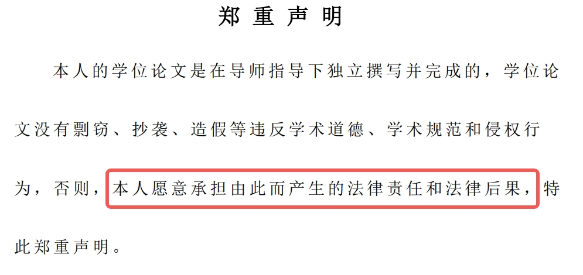 

---

该事件女主角提交给法院的相关视频、录音及图片证据[百度网盘](https://pan.baidu.com/s/1Jvw5mXjDltMEHARtg6c6Rg?pwd=i86x)

❗博主（李然于心）被粉衣哥带几个金哥深夜登门拜访了！！！视频在[夸克网盘](https://pan.quark.cn/s/10cebfa84661#/list/share)，顿时有点害怕捏！！！  

杨景媛的硕士学位论文调查审核网盘：[夸克网盘](https://pan.quark.cn/s/b94924fdb2c0)，有本项目缺少的印度数据。

友情链接：[杨景媛事件相关](https://github.com/yangjingyuan0828/awesome-yangjingyuan)

## 📋TODO  
- [x] 收集论文中存在问题(不断更新中...)
- [x] 发布[举报地址合集](./doc/compilations.md) (不断更新中...)
- [x] 提供将本文档转为pdf的[教程](./doc/export2PDF.md) 🔥🔥🔥
- [x] [武汉大学经济与管理学院专业硕士学位论文写作指南（2024年第二版）](https://mpacc.whu.edu.cn/info/1028/3056.htm)
- [x] [2019年的武汉大学经管学院论文写作规范](https://mpacc.whu.edu.cn/info/1026/1193.htm)
- [x] 向中华人民共和国教育部举报[如图](./doc/jb1.jpeg)
- [x] 向[教育部学位与研究生教育发展中心](https://www.cdgdc.edu.cn/info/1024/2316.htm)举报
- [x] 向[武汉大学学术委员会](xsxf@whu.edu.cn)举报
- [x] 向[教育部学位与研究生教育发展中心](jdjb@cdgdc.edu.cn)举报
- [ ] 在教育部科研诚信管理信息系统举报
- [ ] 向湖北省教育厅举报
- [ ] 向爱思唯尔及所有大型SCI/SSCI出版机构的主编/副主编通报武汉大学所有涉嫌学术不端的论文和提交涉及学术腐败相关的证据，要求重点审查该校学术出版物
- [ ] ...

## 我们的诉求
- 要求武汉大学撤销杨某媛的硕士学位。  
- 要求武汉大学撤销对肖同学的处罚决定，并公开致歉。  
- 要求武汉大学保证肖同学在各项学习成绩达标的前提下顺利毕业，不能以身心健康问题或超过学习期限为由将肖同学退学。  
- 要求公布杨某媛的高考录取信息。
- 请党组织今后不要同意杨某媛的预备党员转正申请。

## 🔧论文主要问题
### 涉嫌造假  

1. 疑似内容编造(第一页倒数第三行内容)： 

>例如部分国家和地区出台的《立即逮捕法案》， 

并未找到因家暴出台的《立即逮捕法案》，此处疑似为 强制逮捕法案（mandatory arrest laws）。

2. 内容编造(第二页第五行内容)：  

>而在 2001 年随着《离婚法》的出台与宣传 

我国并未颁布《离婚法》，此为杜撰内容。

3. 数据编造(第十四页的图2.1)：  

>图2.1 全球各国家暴发生率直方图：
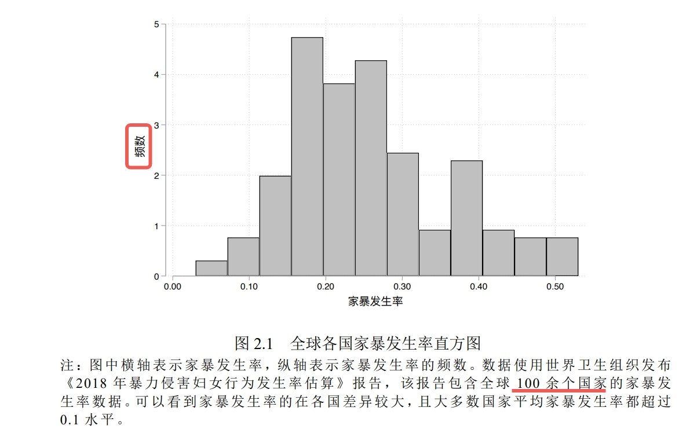  

纵坐标为频数，频数指的是xxx出现的次数，只能是整数，可是论文图中却出现了小数，说明该数据为编造数据。 

且就算把每一条都按最大值5来计算，也只有60，根本凑不满100个国家，疑似数据编造。

4. 疑似数据编造(第四十三页的表5.1)：  

>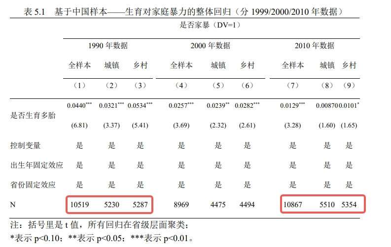  

城镇样本与乡村样本之和不等于全样本，疑似数据编造。  
例如：5230+5287=10517≠10519  
&emsp;&emsp;&emsp;5510+5354=10864≠10867   

并且该表没有说明是否家暴和是否生育之间的先后顺序，无法说明家暴和生育的因果性。

注意该表格的标题为：
>表 5.1 基于中国样本——生育对家庭暴力的整体回归（分 1999/2000/2010 年数据）

可表格内容却是1990、2000、2010年，说明疑似标题手误将“1990”写成了“1999”

5. 疑似数据编造(第四十五页的表5.2)：  

>  

城镇样本与乡村样本之和不等于全样本，疑似数据编造。  

6. 疑似数据编造(第四十六页的表5.3)：  

>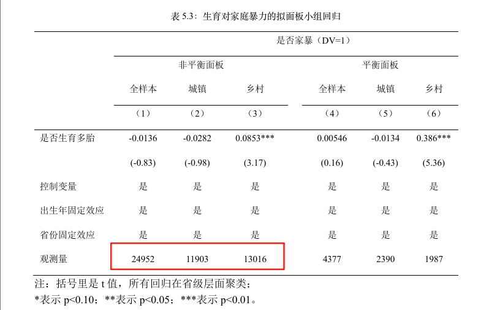  

城镇样本与乡村样本之和不等于全样本，疑似数据编造。  

7. 疑似数据编造(第四十七页的表5.4)：  

>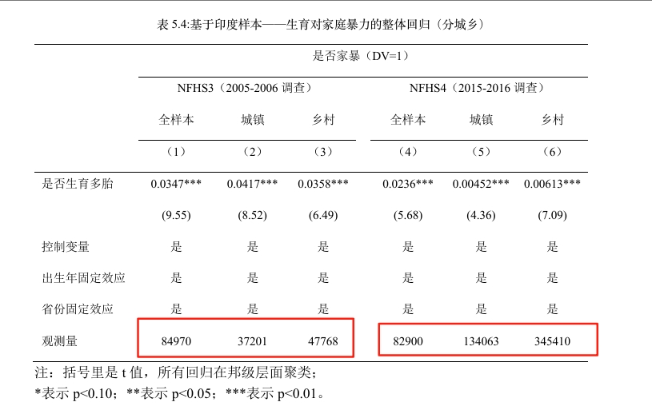   

城镇样本与乡村样本之和不等于全样本，疑似数据编造。  

8. 疑似数据编造(第四十八页的表5.5)：  

>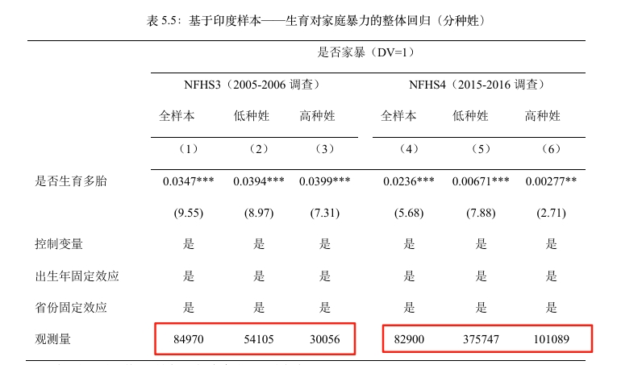  

高种姓样本与低种姓样本之和不等于全样本，疑似数据编造。

### 涉嫌抄袭剽窃

1. 整段抄袭(第二页最后一段内容)：  

>在印度，根据印度国家犯罪研究局的官方报告，2019 年针对妇女的 40.5 万犯罪案件中，其中有超过 30%是家庭暴力案件。2021 年印度 NFHS-5 数据显示，在 18~49 岁的印度女性中，近三分之一的人遭受过家庭暴力，32%的已婚女性曾遭受伴侣在身体、性或情感等方面的暴力，其中 27%的女性在调查的近一年时间内至少遭受过一种形式的暴力。  

涉嫌抄袭论文 何晖,王凌林.印度反家庭暴力的实践与成效[J].现代世界警察, 2022(11):58-64 ，杨的原文内未出现任何引用。  

  

2. 整段抄袭(第三页第一段内容)：

>不完善的法律制度与复杂的举报流程是印度家庭暴力频发的外在原因。早在1983 年，印度刑法典修订的第 498A 条就规定如果丈夫或夫家亲属虐待妇女，处以最高三年的监禁及相应罚款。2005 年 6 月，印度通过首部《反家庭暴力法》。但印度反家庭暴力的法律并没有根据社会的变化进行修改。同时，复杂的举报证据与流程，加之缺乏严格执法，使印度反家庭暴力法律制度有名无实、形同虚设，很多案件不了了之。截至 2020 年底，基于第 498A 的定罪率不到 20%，印度法院总共有 65.1 万起 498A 家庭暴力案件悬而未决。

涉嫌抄袭论文 何晖,王凌林.印度反家庭暴力的实践与成效[J].现代世界警察, 2022(11):58-64 ，杨的原文内未出现任何引用。

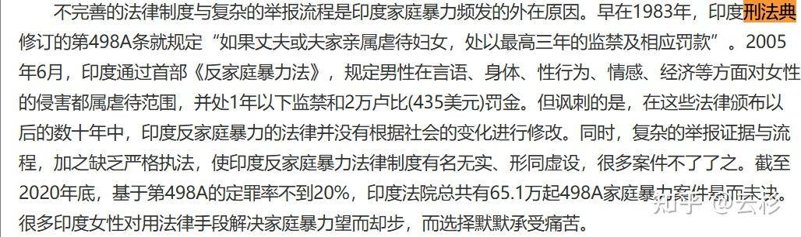  

3. 疑似抄袭未删干净(第四页最后一段的内容)：  

>2013 年 12 月，第十二届全国人大常委会通过了《关于调整完善生育政策的
决议》，其中规定，即单独二孩政策。不到两年后，为更进一步促进人口均衡发
展，修正逐渐失衡的人口结构，2015 年 10 月，中共十八届五中全会明确提出实
施全面二孩政策，从此，所有夫妇都获得了生育两个子女的权利。

“其中规定，即单独二孩政策。”与前后文不搭，疑似抄袭未删干净。  

### 数据错误

1. 数量错误(第三页倒数第六行内容)：

>全球两百多个国家中有 104 个国家的总和生育率低于代际人口平衡所需的 2.1 以下

全球总共有193个联合国会员国，4个联合国观察员国（梵蒂冈、巴勒斯坦、库克群岛、纽埃），并非两百多个国家，作者疑似将港澳台地区算作国家，这属于严重的**政治错误**，建议严查。

2. 年份错误(第四页第七行内容)：  

>新中国成立之后，由于社会经济的逐渐稳定与发展，全国总人口从 1049 年之前的 5.42 亿增长到 1970 年的 8.30 亿。

我国于1949年成立，并非1049年，这属于严重的**政治错误**。

3. 常识性错误(第十五页最后一段内容)：   

>预计到 2087 年，世界人口将达到峰值 103 亿人，之后将缓慢下降至 2100 年的 103 亿人。”   

这降了啥？其中必有一个数据是错误的。   

4. 横坐标异常(第二十页图 2.8、图2.9)：   
   
>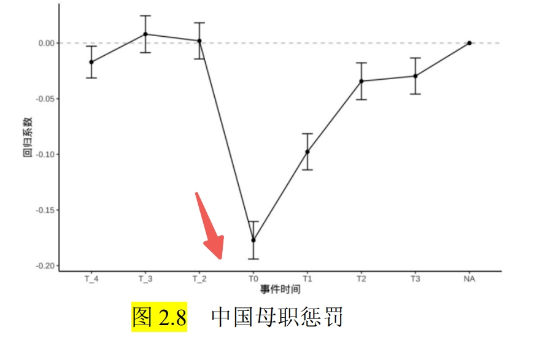  

疑似漏掉了T_1。 

5. 表格数据错误(第三十九页表4.1)：  

>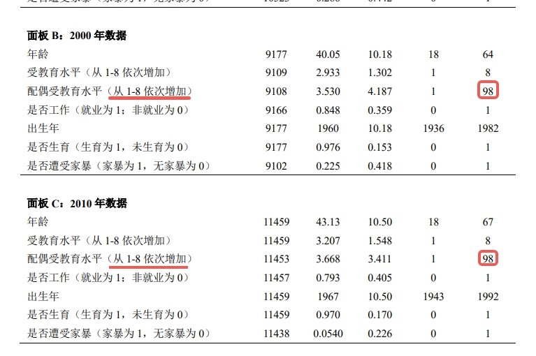  

表4.1的面板b和面板c中的最大值异常。  

6. 表格数据错误(第四十页表4.2)：  

>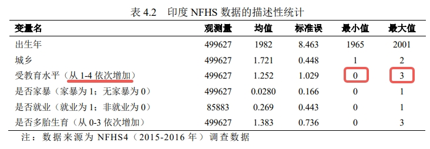   

表4.2的中的最小值、最大值与区间不一致。   

7. 年份错误(第四十五页最后一段第四行内容)：   

>1990-201 年生育对家暴的影响不断减弱  

年份漏写一个数字。 

8. 横坐标异常(第五十五页图 6.7)： 
  
>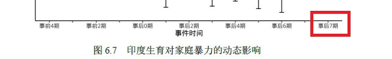  

疑似将事后8期写为事后7期。 

9. 捏造数据(第十三页1.1.2最后一段)：

>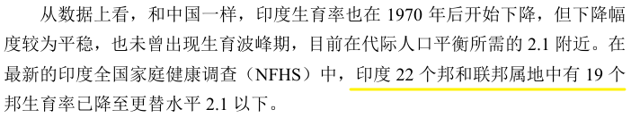

印度并非只有22个邦和联邦属地，数据完全对不上。
相关链接：https://dhsprogram.com/pubs/pdf/fr339/fr339.pdf

>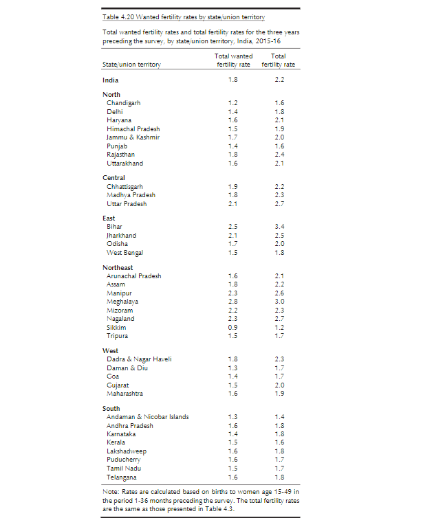

10. 捏造数据(第四十一页表4.3)：

>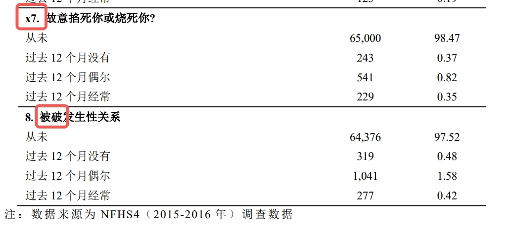

相关链接：https://dhsprogram.com/pubs/pdf/fr339/fr339.pdf
这数据完全对不上，总人数才61906。

>

11. 数据不一致(第十页与第四十七页)：

论文第十页"家庭暴力的中印现状"子标题下提到：
>
>"2010年的调查数据显示我国妇女遭受家庭暴力的占比降至8.8%"。

但论文第四十七页表4.1
>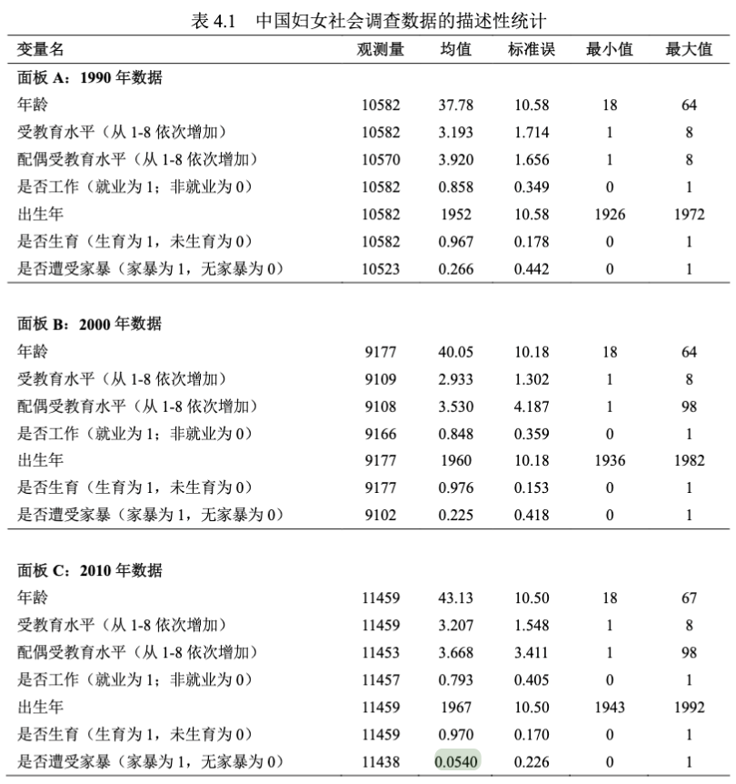
>"中国妇女社会调查数据的描述性统计"中2010年数据显示，我国妇女遭受家庭暴力的占比仅为0.0540（即5.4%）。


根据《第三期中国妇女社会地位调查 全国主要数据报告》第16页的数据：
- 广义家庭暴力（包括侮辱谩骂、殴打、限制人身自由、经济控制、强迫性生活等）：24.7%
- 狭义家庭暴力（明确表示遭受过配偶殴打）：5.5%

显然，正文中的8.8%与表格中的5.4%存在矛盾，且8.8%的数据来源不明，疑似为编造数据。表格中的5.4%与官方报告中的5.5%基本一致，说明作者知道正确数据应该是多少，但在正文中却使用了错误的8.8%。

### 数据分析错误

1. 常识性分析错误(第二十一页第一段倒数三行内容)：  

>  

如上图所示,0.01% 应为10000位女性中有一位。  

2. 数据分析异常(第二十四页的图2.15)：  

>  

对第二十四页论文中的图2.15（上图2.1）数据进行扒取，并对图片进行线性拟合（见上图2.2），得出图片线性拟合为y=0.1067xR2=01083，详细数据见[附件](./paper/testdata.csv)。  
经验证，该数据的r方仅有0.1，证明生育数量与家暴发生率几乎无关。  

3. 分析错误与宗教偏见(第二十五页倒数第六行内容)：   

>本文用各地区人均道观数据衡量该地区思想传统程度

**方法论错误**：道教属于宗教范畴，不同地区的宗教分布不一致，故人均道观数跟当地思想传统程度无直接关系。

**宗教偏见问题**：
- 仅选择道教场所而忽略佛教寺庙、基督教堂等其他宗教场所，存在明显的**选择性偏见**
- 在多元宗教环境中单一选择道教数据，缺乏宗教代表性和包容性
- 该选择性使用可能构成对其他宗教的**系统性歧视**

4. 强行拟合(第二十六页图2.18)：  

>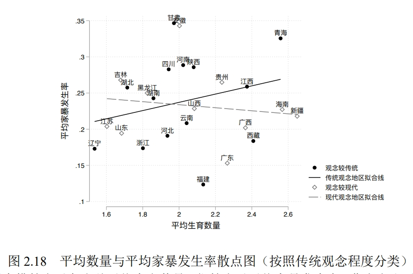   

图中的点散度过大，无明显线性关系。其中同为观念传统地区且生育率相近的甘肃和福建的家暴跨度过大，可说明该线不适合证明观念与家暴之间的关系。 

5. 数据缺失未说明(第二十六页图2.18)：  

图2.18缺少4个直辖市（北京、上海、天津、重庆）、2个特别行政区（香港、澳门），以及宁夏和内蒙古2个自治区和台湾省的数据点，并未作任何说明。这种重要数据缺失不仅影响分析的完整性，也降低了研究结论的可信度。

6. 严重篡改引用文献原意(第二十八页倒数第二段):

>ϕ ≥ 0表示生育子女带来的净收益，

**学术不端分析**：杨的论文声称基于Doepke & Kindermann (2019)构建模型，但严重篡改了原文献含义。

**原文献信息**：
>Doepke, M., & Kindermann, F. (2019). Bargaining over babies: Theory, evidence, and policy implications. *American Economic Review*, 109(9), 3264-3306.
- DOI: 10.1257/aer.20160328

**原文献公式**：
```math
c^f + c^m = (1+\alpha)(w^f + w^m - \phi b)
```

**原文献原文**：
>For a cooperating couple, the budget constraint is then given by:

```math
c^f + c^m = (1+\alpha)(w^f + w^m - \phi b)
```

**原文献解释**：公式中的"-ϕ"以及后续"consumption"一词明确表明，原文献认为生育带来的是支出(cost)，而非收益。

**篡改性质**：
- **直接篡改**：将原文献中的"生育成本"(-ϕ)篡改为"生育收益"(ϕ≥0)
- **逻辑缺陷**：在提出"生育带来正收益"时，未提供任何支持论据，也未讨论如何否定引用文献的成本观点
- **连锁错误**：此篡改导致第32页命题二及全文主要结论完全失效

这属于学术不端中的"篡改引用文献原意，使其对己有利"，是严重的学术诚信违规行为。

7. 公式分析错误(第三十三页第七行内容)：   

>增加量为1/2   

此处增加量应为ϕα/2。

8. 模型使用错误(第三十七页)： 

在论文第4 节 4.数据与实证策略 4.1.实证策略 4.1.1.基于双重固定效应模型的实证策略.

>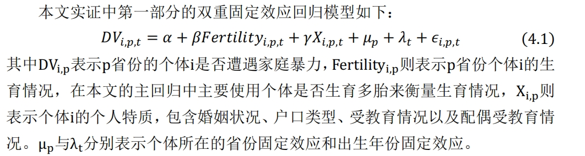  

该模型的被解释变量 DV, 代表个体是否遭遇家庭暴力; 由于被解释变量DV只有两种取值（二元变量），有或者没有遭遇家庭暴力, 因而这是一个典型的『二元选择模型（binary choice model）』  
计量经济学的基本常识: 不能用线性模型来解释一个二元选择变量. 应该使用 Logistic回归 或 Probit回归模型。  
但是, 论文中使用的所谓 "双重固定效应回归模型" 4.1 是一个线性模型. 这是一个严重的错误. 论文使用了错误的模型, 主要实证结果不可靠.  

9. 低级计算错误(第四十三页倒数第一行内容)：   

>城镇样本家暴发生率上升 3.2%，而乡村家暴发生率上升 5.4%，二者相差 2.1%。

5.4%-3.2%=2.2%，并非2.1%。  

10. 自相矛盾(第十页)：

>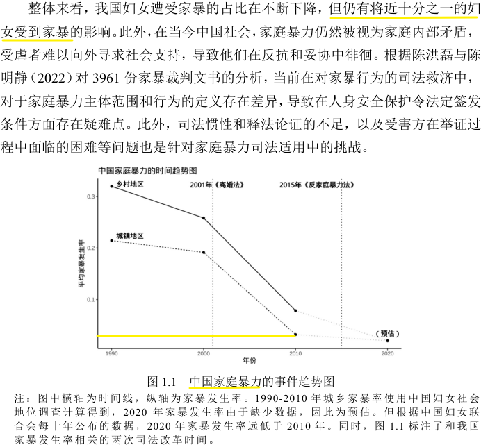

前面说十分之一妇女，但是图里显示远低于0.1，而且是不分男女的。

11. 政策启示与结论对冲(第六十一页)：

7.1.结论第二段：

>首先，生育使得家庭暴力的发生率上升。在中国和印度，随着生育数量的增多，家暴发生率也不断上升。

7.2.政策启示第四点：

>第四，提供更多生育支持，建立生育友好社会。加大对生育的政策支持力度，为妇女提供更加全面的生育支持和保障

政策启示“加大生育支持以降低家暴”与结论中“生育导致家暴增加”疑似逻辑冲突。

12. 严重统计方法错误：未使用样本权重进行加权分析

论文使用了NFHS（印度国家家庭健康调查）和中国妇女社会地位调查数据，这两个调查均采用分层抽样设计的全国代表性样本。然而，论文中从未提及使用样本权重（sampling weights）进行加权分析。

分层抽样调查的基本要求是必须使用样本权重来确保：
- 不同地区、不同人群的代表性
- 统计推断的有效性和无偏性
- 结果能够代表总体而非仅仅是样本

不使用样本权重的后果：
- 统计结果存在系统性偏误
- 无法进行有效的统计推断
- 研究结论不具备代表性
- 违反了调查数据使用的基本规范

这是计量经济学和统计学的基本常识，该错误严重影响了论文所有实证结果的可信度。

### 重要数据未引用

文中多处重要数据未引用，找不到来源，怀疑该数据的真实性。

>  
 

### 写作与表达错误

1. 摘要翻译错误：  
>中文关键词：生育；家庭暴力；母职惩罚；社会规范

>英文关键词：Fertility；Domestic Violence；Outside Option；Social Norm  

“母职惩罚”和“Outside Option”的翻译无法对应。

2. 摘要翻译问题：  

>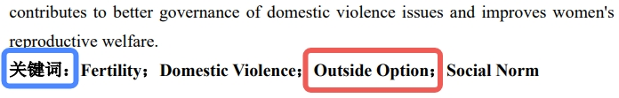 

其中**关键词**三个字未翻译为英文Keywords。  

3. 英文摘要问题(英文摘要第十行)：

>Survey and the the National Family and Health Survey of India. 

同时出现两个"the"。

4. 概念混淆(第一页第二段第一至三行内容)：  

>世界卫生组织 2018 年发布的《全球、区域及国家针对妇女的家庭暴力发生率调查》中显示适龄女性的家庭暴力终身发生率仍然高达 27%，即有 27%的女性一生中至少遭受过一次来自丈夫或男性亲密伴侣的身体和/或性暴力侵害   

男性亲密伴侣没结婚的话不算家暴。  

5. 错别字(第三页图1.2的图注)：  

>注：图中横轴为时间线，纵轴为家暴发生率。1998-2021 年家暴发生率使用印度 NFHS2-5次调查计算得到。同时，图 1.2 标注了和印度家暴发生率相关的司法改革时间，此外，从2006 年开始印度民间反家暴组织“粉红邦”在印度北方地区开始活跃，也有效降低了家暴的发生率。

将“粉红帮”错写成了“粉红邦”。  

“NFHS2-5次调查” 疑似有语病或符号错误。

6. 错别字(第四页第一行内容)：

>伴随 90 年带股市房市大泡沫破裂  

此处应为“年代”而不是“年带”。   

7. 错别字(第五页第九至十行内容)：  

>这些诊所主要负责发放避孕相关药物即器材”  

将“及”错写为“即”。   

8. 错别字(第六页倒数第六至七行内容)：  

>而决定女性外部选则的关键因素包括女性的特质   

此处应为“选择”而不是“选则”。  

9. 错别字(第八页第六至七行内容)： 

>此时就只会有表达性大家暴  

此处的“大”疑似为“的”。   

10. 错误字符(第八页)：  

第八页 关于家庭暴力的其他文献 中的第六行内容：
>例如，g 通过越南的数据发现  

这个g指代不明，疑似错写字符。  

11. 漏字(第八页最后一行内容)：  

>并不一发生资源的转移

将“不一定”漏写为“不一”。  

12. 错别字(第九页倒数第二行内容)：  

>生育也会是的女性的工资率降低
   
将“使得”错写为“是的”；将“工资”错写为“工资率”。

13. 错别字(第十页最后一段内容)：  

>家庭经济学中围绕家庭暴力机制的讨论主要可以分为两只文献，第一支文献从家庭议价权出发，讨论了表达性家庭暴力背后的价格机制。第二支文献从工具性家暴行为的目的出发，解释了家暴行为可能具有的寻租属性。

将“支”错写为“只”。  

14. 错别字(第十三页2.1.1第一段内容)：  
  
>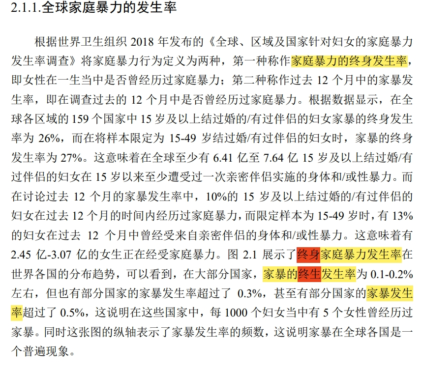

同时出现“家庭暴力的终身发生率”、“终身家庭暴力发生率”、“家暴的终生发生率”和“家暴发生率”四种表达方式。

>疑似将“终身”和“终生”搞混。 

15. 错别字(第十三页倒数第六行内容)：  

>2.45 亿-3.07 亿的女生正在经受家庭暴力。   

疑似将“女性”错写为“女生”。

16. 写错时间(第十五页第一段第四行内容)：  

>与 1960 年 -1665 之间的剧烈增长形成明显对比  

疑似将“1965年”写为“1665”。 

17. 错别字(第十五页倒数第三行内容)：  

>未来非洲人口获奖贡献90%的世界人口增量

疑似把“或将”错写为“获奖”。  

18. 语病及错别字(第十六页倒数第七行内容)：  

>本人认为生育率与家暴发生率之间似乎确实存在某种正向关系   

疑似把“本文”错写为“本人”；“似乎确实”存在严重语病。  

19. 错别字(第十八页第三行内容)：  

>就业情况等多个纬度

把“维度”错写为“纬度”。 

20. 错别字(第十八页第二段第六行内容)： 

>生育确实给女性就业遭成了影响   

把“造”错写为“遭”。  

21. 错别字(第十八页第二段最后一行内容)：  
>和丈夫相对收入水平的不同以及生育情况都对家暴遭成了影响。  

把“造”错写为“遭”。  

22. 错别字(第十八页最后一段第三行内容)：  

>几乎可以忽略不及   

此处可能存在语病，且把“忽略不计”错写为“忽略不及”。  

23. 字符顺序错误(第二十二页倒数第六行内容)：  

>可以看到当女性收入远小于丈夫（即不到丈夫收入的 1/4 时），家暴发生率较高   

应该把“时”移到右括号右边。  

24. 错别字(第二十四页第一段第三行内容)：  

>这和本文之间预设的研究框架相符。   

疑似把“之前”错写为“之间”。   

25. 多余字(第二十四页第二段第一行内容)：  

>图 2.16 通展示了我国生育数量与平均家暴发生率之间的关系。   

其中的“通”为多余字。   

26. 标点符号错误(p25)：  

>第二十五页倒数第五行内容：“甘肃，福建西藏以及辽宁等地”   

甘肃、福建应该用顿号；福建西藏之间没加顿号。  

27. 用词不当(第二十六页倒数第六行内容)：  

>本文各省份分为宗族思想较强和宗族思想较弱的地区   

疑似把“图中”错写为“本文”。 

28. 图片标题错误(第二十六页)：  

图 2.19 下方的标题：
>“图2.19 平均数量与平均家暴发生率散点图（按照宗族文化程度分类）”   

将“平均生育数量”漏写为“平均数量”。  

29. 图注错误(第二十七页图2.19下面的标注)：  

图2.19下面的标注：
>注：图中横轴表示各省份平均生育数量，纵轴表示平均家暴发生率。本文使用了 Chen（2021）中对宗族文化的横梁变量，即各地区人均家谱数，并基于此变量分类。其中实点与实线表示宗族观念较强的地区，虚点与虚线表示宗族观念较弱的地区，结果发现，在宗族观念较弱的地区，生育数量与家暴发生率为正相关关系。

把“衡量”错写为“横梁”。  

30. 简称错误(第二十七页2.2.4节内容)：  

>也被称作受压迫的种姓（Scheduled Castes，简称 CS）   

简称错误，应为SCs或SC。  

31. 文字重复，缺标点符号(第三十五页最后一行至三十六页第一行的内容)：  

>从经济激励上，丈夫家暴的丈夫家暴的概率越高   

“丈夫家暴的”五个字重复，且最后忘记加句号。  

32. 多写符号(第四十页倒数第三行内容)：  

>包括丈夫是否曾经对你有过殴打等行为，。   

多写了一个逗号。    

33. 写错单词(第四十页倒数第二行内容)：  

>NHHS4 调查中关于受访者回答的描述性统计见表 4.3.从表中可以看到   

将“NFHS4”错写为“NHHS4”。  

34. 多处空格混乱：  

文中多处将“NHHS4”和“NHHS 4”以及将“NHHS3”和“NHHS 3”混着写，中间是否有空格未知。例如第四十页倒数第一段。

35. 错别字及错误字符(第四十一页的表格)：  

>  

疑似将“7.”写成了“x7.”

将“被迫”写成了“被破”。

36. 多写符号(第四十三页倒数第四行内容)：  

>3（生育 5 个以上）），家暴概率上升 4.4%。   

连续写了两个右括号。  

37. 不合适的主语(第四十五页第一行内容)：  

>本人仍采用个体是否 40 岁进行分组”   

疑似把“本文”错写为“本人”。  

38. 错别字(第四十五页倒数第五至六行内容)：  

>因此外部选择被恶化，更容易受到家暴，而当后代长大承认，  

疑似将“因为”写成了“因此”；将“长大成人”写成了“长大承认”。  

39. 文字重复(第四十八页倒数第二段第二至三行内容)：  

>无论是 NFHS3（2005-2006 年调查）还是 NFHS4（2015 与 2017 调查）调查  

“调查”二字重复。  

40. 符号错误(第四十八页倒数第二段最后一句内容)：  

>和中国相同的是，随着时间推移，生育对家暴的影响下降在城镇地区更为明显；  

段落最后以分号结尾。  

41. 文字重复(第四十九页第一段第五行内容)：  

>考虑在事件事件为 0（子女出生当年），  

“事件”二字重复。  

42. 错别字(第五十页倒数第二段第二行内容)：  

>诚征在生育后第一期就出现了明显的家暴上升，  

将“城镇”写成了“诚征”。  

43. 错别字(第五十六页中间段第三行内容)：  

>而在平均受教育水平的人均中  

将“人群”写成了“人均”。  

44. 多写符号(第五十六页倒数第三行内容)：  

>人口大邦（占全样本 95%以上）的母职惩罚）。   

母职惩罚后面多写了一个右括号。  

45. 错别字(第五十七页中间段第二行内容)：  

>从生育档期开始一直持续到生育后的第八年”  

疑似将“当期”写成了“档期”。 

46. 错别字(第五十九页第一段第三行内容)：  

>生育后家暴发生率会即可下降  

将“即刻”写成了“即可”。  

47. 错别字(第五十九页第二段第三行内容)：  

>受教育群体较高的人群  

将“受教育水平较高”写成了“受教育群体较高”。  

48. 错别字(第六十一页政策启示第三段最后一行内容)：  

>可以让受害者更方面的结束暴力关系  

将“方便”写成了“方面”。  

49. 错别字(第六十七页致谢部分第三段第四行内容)： 

>所以我希翼能构建一个生育友好型的社会”   

疑似将“希冀”写成了“希翼”。  

50. 标点符号错误(第六十七页致谢部分第四段第一行内容)：  

>我们时常听到现如今中国女性的地位难道还不够高吗？， 

问号和逗号连用。  

52. 标点符号错误(第六十八页致谢部分倒数第二段内容)：  

>We make our world significant by the courage of our questions and by the depth of our answers。 

致谢中的英文以中文句号结尾。

53. 多处名字写错(第十七、二十、二十五、四十、四十二、五十一、五十五页)：  

1、多处将“Kleven”写成“Kelvin”，分别出现在第十七、四十、四十二页。  
2、多处将“Kleven”写成“Kelven”，分别出现在第二十、五十五页。  
3、将“Kleven”写成“Kelvev”，出现在第二十五页。
4、将“Kleven”写成“Kelevn”，出现在第五十一页。 

54. 多处图注内容错误(第五十六、五十七、五十八页)：  

1、图6.8注中将“NFHS 3”写成“NFHS3 年” 
2、图6.9注中将“NFHS 3”写成“NFHS3 年” 
3、图6.10注中将“NFHS 3”写成“NFHS3 年”  
4、图6.11注中将“NFHS 3”写成“NFHS3 年”  

51. 严重语病，且句尾无标点符号。论文第35页
> “此外，若生育导致妻子外部选择恶化的程度越严重，则丈夫可以从家暴妻子中获得的转移支付越多，从经济激励上，**丈夫家暴的丈夫家暴的概率越高**”


### 格式与规范错误

1. 页码错误：  
>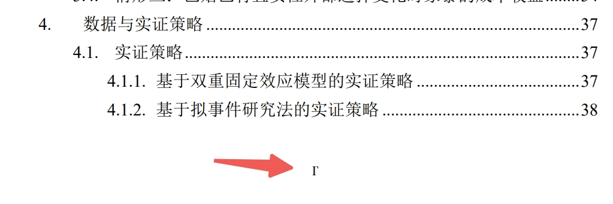

论文的封面、声明、摘要、目录底下的页码的格式均存在问题。

另外，好像封面不需要页码吧？

2. 缩进问题：  

论文的英文摘要每一段开头未缩进。

3. 格式错误(第一页第二段第二至三行内容)：  

>即有 27%的女性一生中至少遭受过一次来自丈夫或男性亲密伴侣的身体和/或性暴力侵害  

没有必要使用“和/或”，直接使用或也能表达和的意思。 

4. 字体问题(第十五页第一段内容)： 

>&emsp;&emsp;工业化、城市化进程的推进使世界人口经历了从高出生率、高死亡率的低增长阶段，变更到高出生率、低死亡率的高增长阶段。当代世界人口出生率不断降低，人口增长情况正处在由高增长向低增长转变的过渡阶段。**根据图 2.2 所示。从上世纪 70 年代以来，世界范围内人口总和生育率开始明显下降，与 1960 年-1665 之间的剧烈增长形成明显对比。平均每个妇女在育龄期间会生育的子女数从 1970 年的 4.79 降至 2019 年的 2.40，降幅接近一半。截止 2021 年，世界平均总和生育率已接近代际人口平衡所需的 2.1。**  

未知意义的粗体文字。 

5. 图片标题格式错误(第十六页)：  

> 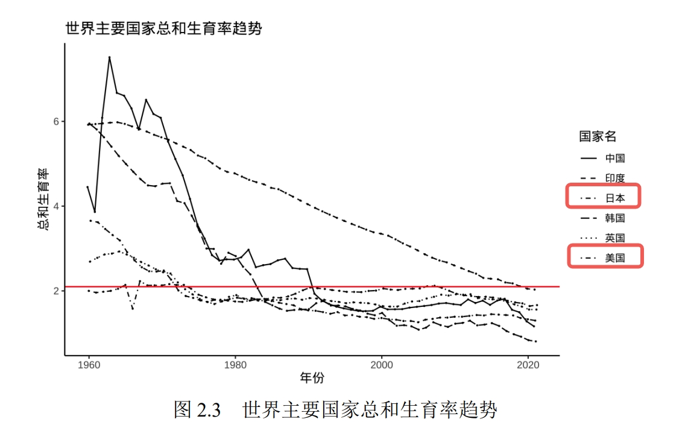 

其中日本和美国用了相同的线。  

6. 字体错误(第二十七页)：  

正文的数字和英文字母虽然文中大部分地方都正确使用Times New Roman字体，但是仍有不少正文的数字和英文并不是该字体，例如第二十七页：  

> 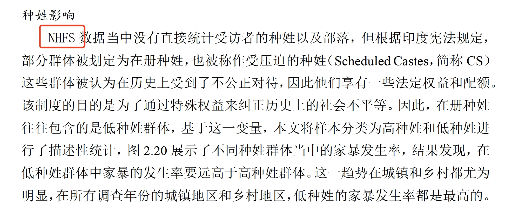 

7. 图片标题格式错误(第四十四页)：  

>图 5.1：生育子女数量对家庭暴力的影响 

其中图 5.1 后面加了冒号，与前后文格式不匹配。  

8. 引用格式错误(第五十三页最后一段第一行内容)：  

>本文基于 Chen（2021 年）构建的各地区宗族变量”  

该引用格式与前后文不一致。 

9. 个人疑惑

武大经管的毕业论文引用文献是按首字母排序的吗？不用交叉引用的吗？感觉非常奇怪。请武大官方给出确切的格式说明。 

### 学术伦理问题
该文章阐述家庭暴力与生育、传统文化、宗教、女性就业之间的关联，在数据拟合度低的情况下强行将家暴与文化、宗教捆绑，该课题可能涉及较为严重的**学术伦理问题**。

#### 宗教歧视问题
论文在宗教数据使用方面存在明显的**选择性偏见**和**宗教歧视**问题：

1. **单一宗教数据选择**：论文第二十五页仅使用"各地区人均道观数据"来衡量地区思想传统程度，完全忽略了佛教寺庙、基督教堂、清真寺等其他宗教场所。

2. **宗教代表性缺失**：中国作为多元宗教社会，佛教、基督教、伊斯兰教等宗教在不同地区都有重要影响，仅选择道教数据存在严重的**代表性偏差**。

3. **方法论歧视**：在没有任何理论或实证依据的情况下，将道教等同于"传统思想"，而排除其他宗教，构成了系统性的**宗教歧视**。

4. **逻辑矛盾**：如果作者真如外界传言具有佛教背景（如手抄佛经等），却在学术研究中刻意排除佛教场所数据，更凸显了其研究方法的**偏见性**和**不诚实性**。

该问题不仅违反了学术研究的**客观性原则**，也可能涉及**宗教歧视**的伦理问题，严重损害了学术研究的公正性和可信度。  

### 文献引用错误

1. 图表引用错误(第二十六页倒数第七行内容)：  
>图 2.19 反映了这种现象，本文各省份分为宗族思想较强和宗族思想较弱的地区，结果发现，在宗族思想较强的地区，生育数量的上升往往伴随着较低的家暴发生率。  

图 2.19 反应的是家暴和生育的关系，跟宗教没有关系。  

2. 疑似引用重复(第六十三页)：  
 
>[43] Card D, Dahl G B. Family Violence and Football: The Effect of Unexpected Emotional Cues on Violent Behavior[J]. The Quarterly Journal of Economics, 2011, 126(1): 103-143.
[44] Card D, Dahl G B. Family Violence and Football: The Impact of Unexpected Emotional Cues on Violent Behavior[J]. Quarterly Journal of Economics 2011, 126(1): 103-143.  

其中[44]疑似错把“Effect”写为“Impact”。  

3. 疑似标题写错(第六十三页)：  

>[46] Cesur R, Sabia J J. When War Comes Home: The Impact of Combat Service on Domestic Violence[J]. Review of Economics and Statistics, 2016, 98(2): 209-225.  

我查到的题目只有 When War Comes Home: The effect of Combat Service on Domestic Violence

4. 完全重复(第六十四页)：  
  
>[59] Dugan L, Nagin D S, Rosenfeld R. Explaining the Decline in Intimate Partner Homicide: The Effects of Changing Domesticity, Women's Status, and Domestic Violence Resources[J]. Homicide Studies, 1999, 3(3): 187-214.  
[60] Dugan L, Nagin D S, Rosenfeld R. Explaining the Decline in Intimate Partner Homicide: The Effects of Changing Domesticity, Women's Status, and Domestic Violence Resources[J]. Homicide Studies, 1999, 3(3): 187-214.  

5. 引用未写完整(第六十五页)：  

>[72] Guo R. A Theory of Differential Fertility under Filial Piety[J].   

未写明会议/期刊的名称及出版年份。

在corssref、Google Scholar和Google都搜不到该论文，疑似为AI生成。 

6. 完全重复(第六十五页)：  

>[87] McElroy M B, Horney M J. Nash-Bargained Household Decisions: Toward a Generalization of the Theory of Demand[J]. International Economic Review, 1981, 22(2): 333.  
[88] McElroy M B, Horney M J. Nash-Bargained Household Decisions: Toward a Generalization of the Theory of Demand[J]. International Economic Review, 1981, 22(2): 333.  

7. 引用未写完整(第六十六页)：  

>[96] Ramos A. Household Decision Making with Violence: Implications for Conditional Cash Transfer Programs[J].   

未写明会议/期刊的名称及出版年份。  

8. 完全重复(第六十六页)：  
 
>[101]Tauchen H V, Witte A D, Long S K. Domestic Violence: A Nonrandom Affair[J]. International Economic Review, 1991, 32(2): 491.   
[102]Tauchen H, Witte A, Long S. Domestic Violence - a Nonrandom Affair[J]. International Economic Review, 1991, 32(2): 491-511.  

其中[102]中的符号“-”意义不明。  

9. 参考文献发表时间错误(第六十六页)：  

>[103]Terror as a Bargaining Instrument: A Case Study of Dowry Violence in Rural India[J]. The American Economic Review, 2024. 

疑似为了满足引用较新论文的要求，篡改文献发表时间。原时间为：

>Bloch F, Rao V. Terror as a bargaining instrument: A case study of dowry violence in rural India[J]. American Economic Review, 2002, 92(4): 1029-1043.
文献url：https://www.aeaweb.org/articles?id=10.1257/00028280260344588

10. 疑似引用化学论文(第六十六页)：  
>[105]Wilson W W, Haiges R, Christe K. Contents Lists Available at Sciencedirect[J]. 2023.  

该引用中“Contents Lists Available at Sciencedirect”，意思为“可在Sciencedirect获取”，不是某个文章的题目，该文章的出处疑似为化学材料相关期刊，详情如下图：

>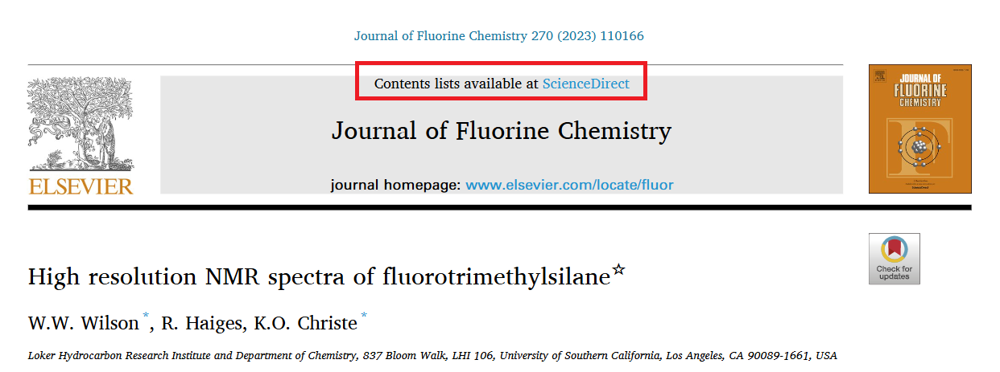

11. 论文正文中很难找到引用了参考文献中的一些文献。 

例如第九至十页1.2.2小节引用的论文，我在参考文献中大部分都找不到。

12. 参考文献内容疑似未在正文引用  
通过对第一作者进行全文检索（杨在正文中并没有使用参考文献编号来进行引用），发现以下参考文献在正文中没有被引用：
```
[2], [3], [4], [5], [6], [8], [9], [10], [11], [13], [14], [15], [16], [17], [18], [19], [20], [21], [22], [23], [25], [28], [29], [31], [32], [33], [34], [37], [38], [39], [41], [42], [45], [46], [48], [49], [51], [52], [53], [54], [55], [58], [61], [62], [64], [66], [68], [70], [72], [73], [75], [76], [77], [80], [89], [90], [91], [92], [93], [94], [96], [97], [98], [99], [100], [104], [105]
```
共计 67 条，占参考文献总数的一半以上。

13. 参考文献格式不符合武汉大学经管学院硕士学位论文规范  
参考文献[100]到[107]，序号与姓名间（]之后）无空格  

14. 严重误用Pollak (2004)文献，篡改原文含义

论文多处引用Pollak (2004)的《代际家庭暴力模型》，但存在严重的误用和曲解：

**误用案例一：将"社会传递"曲解为"遗传特征"**

论文原文：
>家暴带来的影响不仅体现在当代，研究表明，家暴具有代际遗传特征，在暴力家庭长大的人往往会将暴力行为遗传下去（Pollak，2004）。

**问题分析**：
- Pollak (2004)讨论的是家庭暴力的"代际传递"(intergenerational transmission)，强调的是社会学习机制
- 原文明确指出这是"行为策略或脚本从父母传递给子女"的社会现象
- 论文使用"代际遗传特征"和"遗传下去"的表述，错误地暗示这是生物学遗传，严重曲解了原文的社会传递概念

**误用案例二：错误归类为议价理论框架**

论文原文：
>在家庭议价权中，经济学者往往将家庭暴力视作一种表达行为，即家庭暴力会直接给施暴者带来效用。造成这种暴力倾向的原因可能是孩童时期目睹或者经历过家暴（Bowlus 和 Seitz，2006；Pollak，2004）。根据议价理论，暴力只是一种让施暴者效用增加而受害者效用减少的行为，因此，家庭就会就最佳暴力程度进行议价并通过金钱转移对受虐者进行补偿。

**问题分析**：
- Pollak (2004)明确声明其模型"忽略议价和理性选择，专注于家庭暴力的代际相关性"
- 原文采用的是概率模型而非效用最大化或战略谈判模型
- 论文错误地将Pollak的研究归类到议价理论框架中，与原文方法论完全不符
- 原文从未讨论"最佳暴力程度"或"金钱转移补偿"等概念

**误用案例三：性别焦点的偏颇解读**

论文原文：
>此外，也有部分文献抛开了单一代际的家庭内部，从其他角度分析了男性的暴力动机：Pollak（2004）构建了一个家暴在代际之间传递的模型，认为父代家庭出现家暴的概率与子代发生家暴的概率呈现正相关关系。

**问题分析**：
- 虽然正相关关系的描述基本准确，但将研究重点描述为"男性的暴力动机"是片面的
- Pollak (2004)的模型同时考虑男性(暴力实施)和女性(容忍暴力)的行为，强调"男性和女性的异质性是核心"
- 论文的表述忽略了女性在代际传递循环中的作用，过度简化了原文的复杂性

**学术不端性质**：
这些误用构成严重的学术不端行为：
- **曲解引用**：将社会传递概念错误表述为生物遗传
- **错误归类**：将非议价理论研究强行纳入议价理论框架
- **选择性引用**：仅关注部分内容而忽略原文的完整论述
- **误导读者**：可能使读者对相关文献产生错误理解

## 本人声明
&emsp;&emsp;在预备党员考察期内，杨景媛同志在思想上尖酸刻薄，刻意制造性别对立；在法律上知法犯法，涉嫌恶意诬告他人，无端创造《离婚法》；在学业上敷衍了事，毕业论文问题严重，给学校名誉造成了不可估量的伤害。本人实名反对其党员转正，请党组织今后不要同意杨景媛的预备党员转正申请。

## 📖参考文献
[1]杨景媛. 中印生育行为影响家庭暴力的经济学分析. 武汉大学, 2024

## 🙏acknowledge
- 感谢各位提的issue
- 感谢知乎答主 [云杉](https://www.zhihu.com/question/1932776847508214307/answer/1933277605647349267)
- 感谢知乎答主 [同工Same](https://www.zhihu.com/question/1934664649212683483/answer/1934733318307440479)
- 感谢哔哩哔哩up主 [水论文的程序猿](https://b23.tv/wmJtrZa)

<div align="center">

**[ ⬆️ 返回顶部 ](#目录) | [🌍 English Version](#english-version)**

</div>

---

###### English Version

<h1 align="center">Comprehensive Analysis of Academic Misconduct in Yang Jingyuan's Master's Thesis</h1>

<div align="center">

**Language / 语言**: [中文](#中文版本) | [English](#english-version)

</div>

### Menu

- [📋 Action Items](#action-items)
- [🏗️ Our Demands](#our-demands)
- [🔧 Critical Academic Irregularities](#critical-academic-irregularities) 
  - [💥 Data Fabrication](#data-fabrication-and-falsification)  - Fabricated laws, falsified data, inconsistent tables
  - [📋 Suspected Plagiarism](#suspected-academic-plagiarism)  - Wholesale copying without attribution  
  - [❌ Factual and Computational Errors](#factual-and-computational-errors)  - Year errors, quantity errors, factual mistakes
  - [📊 Analysis Errors](#methodological-and-analytical-deficiencies)  - Calculation errors, model misuse, forced correlations
  - [❓ Absence of Source Attribution](#absence-of-source-attribution)  - Lack of data sources
  - [✏️ Writing Errors](#linguistic-and-translation-deficiencies)  - Typos, grammar, formatting
  - [📄 Format Violations](#format-and-standard-errors)  - Page numbers, fonts, standards
  - [⚖️ Ethics Issues](#ethical-considerations-in-research-design)  - Academic integrity concerns and ethical considerations in research design
  - [📚 Bibliographic Irregularities](#bibliographic-irregularities)  - Duplicate citations, format errors, misrepresentation
- [📝 Academic Integrity Assessment](#academic-integrity-assessment)
- [📖 References](#references)
- [🙏 Acknowledgments](#acknowledgments)

---

This repository provides a systematic documentation of academic irregularities identified in the master's thesis titled "Economic Analysis of How Fertility Behavior Affects Domestic Violence in China and India" by Yang Jingyuan, a graduate student in the International Economics and Trade program at Wuhan University. This compilation represents what we believe to be<sup>[1]</sup> the **most comprehensive** academic integrity assessment of this work available online. The original thesis is accessible [here](./paper/YJYpaper.pdf). We welcome scholarly comments, additional error reports, and information regarding relevant reporting channels. As documented below, this represents the author's own academic declaration:
 

---

**Evidence Documentation**: Video, audio, and photographic evidence submitted to judicial authorities by the complainant is available via [Baidu Cloud](https://pan.baidu.com/s/1Jvw5mXjDltMEHARtg6c6Rg?pwd=i86x)

**Security Notice**: The blogger (Li Ranyu Xin) received an unexpected nocturnal visit from unidentified individuals. Documentation available on [Quark Cloud](https://pan.quark.cn/s/10cebfa84661#/list/share).

**Master's Thesis Repository**:
The master's thesis survey and review by Yang Jingyuan is available on the cloud storage platform [Quark Cloud](https://pan.quark.cn/s/b94924fdb2c0), which contains the missing Indian data for this project.

**Related Resources**: [Yang Jingyuan Incident Documentation](https://github.com/yangjingyuan0828/awesome-yangjingyuan)

## 📋Action Items  
- [x] Compile thesis irregularities (continuously updated)
- [x] Publish [comprehensive reporting directory](./doc/compilations.md) (continuously updated)
- [x] Provide [PDF conversion tutorial](./doc/export2PDF.md) 🔥🔥🔥
- [x] [Wuhan University School of Economics and Management Master's Thesis Writing Guidelines (2024 Second Edition)](https://mpacc.whu.edu.cn/info/1028/3056.htm)
- [x] [2019 Wuhan University School of Economics and Management Thesis Writing Standards](https://mpacc.whu.edu.cn/info/1026/1193.htm)
- [x] Submit formal complaint to the Ministry of Education of the People's Republic of China [documentation](./doc/jb1.jpeg)
- [x] Submit complaint to the [Academic Degrees and Graduate Education Development Center of the Ministry of Education](https://www.cdgdc.edu.cn/info/1024/2316.htm)
- [x] Submit complaint to the [Wuhan University Academic Committee](xsxf@whu.edu.cn)
- [x] Submit complaint to the [Academic Degrees and Graduate Education Development Center](jdjb@cdgdc.edu.cn)
- [ ] Submit complaint through the Ministry of Education Scientific Research Integrity Management Information System
- [ ] Submit complaint to Hubei Provincial Department of Education
- [ ] Notify editors-in-chief and deputy editors-in-chief of Elsevier and major SCI/SSCI publishing institutions regarding suspected academic misconduct at Wuhan University, submitting evidence of academic corruption and requesting enhanced scrutiny of institutional publications
- [ ] Additional actions pending

## Our Demands
- **Degree Revocation**: Demand that Wuhan University revoke Yang Jingyuan's master's degree
- **Disciplinary Reversal**: Demand that Wuhan University rescind disciplinary actions against Student Xiao and issue a public apology
- **Academic Protection**: Ensure Student Xiao's graduation upon meeting academic requirements, without dismissal based on health concerns or timeline violations
- **Transparency**: Demand disclosure of Yang Jingyuan's college entrance examination records
- **Party Membership**: Request denial of Yang Jingyuan's probationary party member confirmation

## 🔧Critical Academic Irregularities
### Data Fabrication and Falsification  

1. **Fabricated Legal Reference** (page 1, third line from bottom): 

>For example, the "Immediate Arrest Act" issued by some countries and regions

There is no documented law concerning domestic violence that is titled the "Immediate Arrest Act." This appears to be a misrepresentation of "Mandatory Arrest Laws."

2. Content fabrication (fifth line of page 2):  

>And in 2001, with the promulgation and publicity of the "Divorce Law" 

The thesis mentions the promulgation of a "Divorce Law" in 2001 in China. No such law exists, indicating fabricated content.

3. Data fabrication (Figure 2.1 on page 14):  

>Figure 2.1 Histogram of domestic violence incidence rates by country globally:
  

Figure 2.1, a histogram of global domestic violence incidence rates, uses frequency as the vertical axis, which should only include integers. However, the figure displays decimal values, suggesting data fabrication. Additionally, even assuming a maximum value of 5 per bar, the total reaches only 60, far short of the claimed 100 countries.

4. Suspected data fabrication (Table 5.1 on page 43):  

>  

The sum of urban and rural samples does not match the total sample size, indicating possible data fabrication.  
For example: 5230+5287=10517≠10519  
&emsp;&emsp;&emsp;5510+5354=10864≠10867   

Furthermore, the table fails to specify the temporal sequence between domestic violence and childbirth, undermining claims of causality.

Note that the table title is:
>Table 5.1 Based on Chinese samples—Overall regression of fertility on domestic violence (1999/2000/2010 data)

The table title references “1999/2000/2010” data, but the content covers 1990, 2000, and 2010, suggesting a typographical error in the title.

5. Suspected data fabrication (Table 5.2 on page 45):  

>  

Mathematical inconsistencies where urban and rural sample sizes fail to sum to reported total sample size, indicating potential data manipulation.  

6. Suspected data fabrication (Table 5.3 on page 46):  

>  

Systematic arithmetic discrepancies between subsample aggregations and reported total sample sizes, suggesting fabricated or manipulated data sets.  

7. Suspected data fabrication (Table 5.4 on page 47):  

>   

Persistent mathematical inconsistencies in sample size reporting, where urban and rural subsamples do not aggregate to stated totals, indicating data integrity violations.  

8. Suspected data fabrication (Table 5.5 on page 48):  

>  

Demographic composition errors where high-caste and low-caste sample sizes fail to sum to total sample size, suggesting systematic data manipulation across caste-based analyses.

### Suspected Academic Plagiarism

1. **Verbatim Plagiarism** (page 2, final paragraph):  

>In India, according to the official report of the National Crime Research Bureau of India, among the 405,000 crimes against women in 2019, more than 30% were domestic violence cases. The 2021 India NFHS-5 data shows that among Indian women aged 18-49, nearly one-third have experienced domestic violence, 32% of married women have experienced physical, sexual or emotional violence from partners, of which 27% of women experienced at least one form of violence in the nearly one year during the survey.

**Analysis**: Direct plagiarism from He Hui & Wang Linglin, "India's Practice and Effectiveness in Anti-Domestic Violence," *Modern World Police*, 2022(11):58-64. No citation provided in the original text.

  

2. **Extensive Textual Appropriation** (page 3, opening paragraph):

>Imperfect legal systems and complex reporting processes are external causes of frequent domestic violence in India. As early as 1983, Article 498A of the revised Indian Penal Code stipulated that if a husband or in-laws abuse women, they face up to three years imprisonment and corresponding fines. In June 2005, India passed its first "Anti-Domestic Violence Law". But India's anti-domestic violence laws have not been revised according to social changes. At the same time, complex reporting evidence and procedures, coupled with lack of strict enforcement, make India's anti-domestic violence legal system exist in name only, and many cases end up unresolved. By the end of 2020, the conviction rate based on Article 498A was less than 20%, and Indian courts had a total of 651,000 pending Article 498A domestic violence cases.

**Analysis**: Additional verbatim plagiarism from the same source (He Hui & Wang Linglin, 2022), demonstrating systematic appropriation of content without attribution.

  

3. Suspected incomplete deletion of plagiarized content (last paragraph of page 4):  

>In December 2013, the 12th National People's Congress Standing Committee passed the "Resolution on Adjusting and Improving Fertility Policy", which stipulated the single-child two-child policy. Less than two years later, to further promote balanced population development and correct the gradually imbalanced population structure, in October 2015, the Fifth Plenary Session of the 18th CPC Central Committee clearly proposed implementing the comprehensive two-child policy, from then on, all couples gained the right to have two children.

"which stipulated the single-child two-child policy" doesn't connect with the context, suspected incomplete deletion of plagiarized content.  

### Factual and Computational Errors

1. **Geopolitical Inaccuracy** (page 3, sixth line from bottom):

>Among more than 200 countries globally, 104 countries have total fertility rates below 2.1 required for intergenerational population balance

**Analysis**: The claim of "more than 200 countries" is factually incorrect. The United Nations recognizes 193 member states plus 4 observer entities (Vatican, Palestine, Cook Islands, Niue). The author's count suggests inappropriate inclusion of Hong Kong, Macao, and Taiwan as separate countries, constituting a serious geopolitical error requiring institutional review.

2. **Historical Inaccuracy** (page 4, line 7):  

>After the founding of New China, due to gradual social and economic stability and development, the national population grew from 542 million before 1049 to 830 million in 1970.

**Analysis**: The People's Republic of China was established in 1949, not 1049. This represents a fundamental historical error with potential political implications.

3. **Logical Inconsistency** (page 15, final paragraph):   

>It is estimated that by 2087, the world population will reach a peak of 10.3 billion, and then slowly decline to 10.3 billion in 2100.

**Analysis**: Mathematical impossibility - no decline can result in identical values. This indicates either data manipulation or careless transcription.   

4. Abnormal horizontal axis (Figure 2.8, Figure 2.9 on page 20):   
   
>  

Suspected missing T_1. 

5. Table data error (Table 4.1 on page 39):  

>  

Maximum values in panels b and c of Table 4.1 are abnormal.  

6. Table data error (Table 4.2 on page 40):  

>   

Minimum and maximum values in Table 4.2 are inconsistent with the ranges.   

7. Year error (fourth line of last paragraph on page 45):   

>The impact of fertility on domestic violence continued to weaken from 1990-201  

Missing a digit in the year. 

8. Abnormal horizontal axis (Figure 6.7 on page 55): 
  
>  

Suspected writing "post-event period 8" as "post-event period 7". 

9. Fabricated data (last paragraph of 1.1.2 on page 13):

>

India does not have only 22 states and union territories; the data is completely incorrect.
Related link: https://dhsprogram.com/pubs/pdf/fr339/fr339.pdf

>

10. Fabricated data (Table 4.3 on page 41):

>

Related link: https://dhsprogram.com/pubs/pdf/fr339/fr339.pdf
This data is completely incorrect; the total population is only 61,906.

>

11. **Data Inconsistency** (pages 10 and 47):

**Analysis**: The thesis presents contradictory domestic violence statistics for 2010. Page 10, under the subheading "Current Status of Domestic Violence in China and India," states:

>
>"The 2010 survey data shows that the proportion of Chinese women suffering from domestic violence dropped to 8.8%."

However, Table 4.1 on page 47:

>
>"Descriptive Statistics of Chinese Women's Social Survey Data" shows that for 2010 data, the proportion of Chinese women suffering from domestic violence is only 0.0540 (i.e., 5.4%).

According to page 16 of the *Third National Survey on the Social Status of Women in China - National Main Data Report*:
- Broad definition of domestic violence (including insults, beatings, restriction of personal freedom, economic control, forced sexual activity, etc.): 24.7%
- Narrow definition of domestic violence (explicitly stating having been beaten by spouse): 5.5%

**Critical Finding**: The 8.8% figure in the main text contradicts the 5.4% in Table 4.1. The 8.8% data source is unidentified and suspected to be fabricated, while the 5.4% aligns closely with the official report's 5.5%. This suggests the author knew the correct data but deliberately used incorrect figures in the narrative text, demonstrating systematic data manipulation.

### Methodological and Analytical Deficiencies

1. Common sense analysis error (third line from bottom of first paragraph on page 21):  

>  

As shown above, 0.01% should be 1 out of 10,000 women.  

2. Abnormal data analysis (Figure 2.15 on page 24):  

>  

Data from Figure 2.15 on page 24 of the thesis (Figure 2.1 above) was extracted and linearly fitted (see Figure 2.2 above), yielding a linear fit of y=0.1067x R²=0.1083. Detailed data is available in the [attachment](./paper/testdata.csv).  
Verification shows this data has an R² of only 0.1, proving that fertility quantity is almost unrelated to domestic violence incidence.  

3. **Methodological Flaw in Cultural Measurement and Religious Bias** (page 25, sixth line from bottom):   

>This thesis uses the number of Taoist temples per capita in each region to measure the degree of traditional thinking in that region

**Methodological Error**: This represents a fundamental misunderstanding of cultural measurement. Religious distribution varies significantly across regions due to historical, geographical, and demographic factors unrelated to "traditional thinking." Using Taoist temple density as a proxy for traditionalism lacks theoretical foundation and empirical validity.

**Religious Discrimination Issues**:
- **Selective Religious Data Usage**: The thesis exclusively uses Taoist temple data while completely ignoring Buddhist temples, Christian churches, mosques, and other religious facilities, demonstrating obvious **selection bias**
- **Lack of Religious Representativeness**: In China's multi-religious society, Buddhism, Christianity, Islam, and other religions have significant influence across different regions. Using only Taoist data creates serious **representational bias**
- **Methodological Discrimination**: Without any theoretical or empirical justification, the thesis equates Taoism with "traditional thought" while excluding other religions, constituting systematic **religious discrimination**
- **Logical Contradiction**: If the author indeed has Buddhist background as alleged (such as copying Buddhist scriptures), yet deliberately excludes Buddhist facility data in academic research, this further highlights the **bias** and **dishonesty** in research methodology

This issue not only violates the **objectivity principle** of academic research but may also involve **religious discrimination** ethical concerns, seriously undermining the fairness and credibility of academic scholarship.

4. **Statistical Overfitting** (Figure 2.18, page 26):  

>   

**Analysis**: The scatter plot exhibits excessive data dispersion with no discernible linear relationship. The forced linear regression line fails to capture meaningful patterns, particularly given the substantial variance between regions with comparable cultural characteristics (e.g., Gansu and Fujian). This represents statistical malpractice in attempting to establish causality. 

5. Missing data without explanation (Figure 2.18 on page 26):  

Figure 2.18 lacks data points for 4 municipalities (Beijing, Shanghai, Tianjin, Chongqing), 2 special administrative regions (Hong Kong, Macao), and 2 autonomous regions (Ningxia, Inner Mongolia) plus Taiwan ROC, without any explanation. This significant data omission not only affects the completeness of the analysis but also reduces the credibility of the research conclusions.

6. **Severe Misrepresentation of Cited Literature** (page 28, second-to-last paragraph):

>ϕ ≥ 0 represents the net benefit brought by having children, 

**Academic Misconduct Analysis**: Yang's thesis claims to be based on Doepke & Kindermann (2019) but severely misrepresents the original literature's meaning.

**Original Literature Information**:
> Doepke, M., & Kindermann, F. (2019). Bargaining over babies: Theory, evidence, and policy implications. *American Economic Review*, 109(9), 3264-3306.
- DOI: 10.1257/aer.20160328

**Original Literature Formula**: 
```math
c^f + c^m = (1+\alpha)(w^f + w^m - \phi b)
```

**Original Literature Quote**: 
>For a cooperating couple, the budget constraint is then given by:

```math
c^f + c^m = (1+\alpha)(w^f + w^m - \phi b)
```

**Original Literature Interpretation**: 
The "-ϕ" in the formula and subsequent use of "consumption" clearly indicate that the original literature treats childbearing as a cost, not a benefit.

**Nature of Misrepresentation**:
- **Direct Falsification**: Transforming the original literature's "childbearing cost" (-ϕ) into "childbearing benefit" (ϕ≥0)
- **Logical Deficiency**: When proposing "childbearing brings positive returns," no supporting evidence is provided, nor is there discussion of how to refute the original literature's cost perspective
- **Cascading Errors**: This misrepresentation renders Proposition Two on page 32 and the thesis's main conclusions completely invalid

This constitutes academic misconduct through "misrepresenting cited literature to favor one's argument," representing a serious violation of academic integrity standards.

7. Formula analysis error (seventh line of page 33):   

>The increase is 1/2   

The increase here should be ϕα/2.

8. **Fundamental Econometric Misspecification** (page 37): 

**Analysis**: Section 4.1.1 employs a two-way fixed effects regression model for binary outcome analysis.

>  

**Critical Error**: The dependent variable DV (domestic violence occurrence) is inherently binary, accepting only dichotomous values (0/1). Econometric theory unequivocally requires logistic or probit regression models for binary choice variables. The application of linear regression to binary outcomes violates fundamental assumptions of ordinary least squares estimation, rendering coefficient estimates biased and hypothesis tests invalid. This methodological error compromises the entire empirical foundation of the thesis.

9. **Elementary Arithmetic Error** (page 43, final line):   

>Urban sample domestic violence incidence increased by 3.2%, while rural domestic violence incidence increased by 5.4%, a difference of 2.1%.

**Analysis**: 5.4% - 3.2% = 2.2%, not 2.1%. This demonstrates carelessness in basic mathematical operations.  

10. Self-contradiction (page 10):

>

Earlier it says one in ten women, but the figure shows far below 0.1, and it's regardless of gender.

11. **Critical Methodological Error: Failure to Use Sampling Weights**

The thesis utilizes data from the NFHS (National Family Health Survey) and China Women's Social Status Survey, both employing stratified sampling designs for national representativeness. However, the thesis completely omits any mention of using sampling weights for weighted analysis.

**Fundamental Requirements for Stratified Survey Data:**
- Sampling weights are mandatory to ensure representativeness across different regions and populations
- Statistical inference validity and unbiased estimation require proper weighting
- Results must represent the population, not merely the sample

**Consequences of Omitting Sampling Weights:**
- Systematic bias in statistical results
- Invalid statistical inference and hypothesis testing
- Research conclusions lack population representativeness
- Violation of basic survey data usage protocols

This represents a fundamental violation of econometric and statistical principles, severely compromising the credibility of all empirical results in the thesis.

12. Policy implications conflict with conclusions (page 61):

Section 7.1 Conclusion, second paragraph:

>First, fertility increases the incidence of domestic violence. In China and India, as the number of births increases, the incidence of domestic violence also continues to rise.

Section 7.2 Policy Implications, fourth point:

>Fourth, provide more fertility support and build a fertility-friendly society. Increase policy support for fertility and provide women with more comprehensive fertility support and protection

The policy implication of "increasing fertility support to reduce domestic violence" seems to logically conflict with the conclusion that "fertility leads to increased domestic violence."

### Absence of Source Attribution

**Analysis**: Numerous statistical claims throughout the thesis lack proper citations, making verification impossible and raising questions about data authenticity and scholarly integrity.

>  
 

### Linguistic and Translation Deficiencies

1. **Translation Inconsistency**:  
>Chinese keywords: Fertility; Domestic Violence; Motherhood Penalty; Social Norms
>English keywords: Fertility; Domestic Violence; Outside Option; Social Norm  

**Analysis**: "Motherhood Penalty" and "Outside Option" represent entirely different economic concepts, indicating fundamental misunderstanding of terminology.

2. **Incomplete Translation**:  

> 

**Analysis**: The Chinese term "关键词" remains untranslated, should read "Keywords" in the English abstract.

3. **Grammatical Error** (English abstract, line 10):

>Survey and the the National Family and Health Survey of India.

**Analysis**: Duplicate definite articles demonstrate lack of proofreading.

4. Concept confusion (first to third lines of second paragraph on page 1):  

>The World Health Organization's 2018 "Global, Regional and National Survey of Domestic Violence Incidence Against Women" shows that the lifetime incidence of domestic violence among women of appropriate age is still as high as 27%, meaning 27% of women experience at least one incident of physical and/or sexual violence from husbands or male intimate partners in their lifetime   

Male intimate partners who are not married don't count as domestic violence.  

5. Typo (caption of Figure 1.2 on page 3):  

>Note: The horizontal axis in the figure is the timeline, and the vertical axis is the domestic violence incidence rate. The 1998-2021 domestic violence incidence rate was calculated using India's NFHS2-5 surveys. Additionally, Figure 1.2 marks the timing of judicial reforms related to India's domestic violence incidence rate. Furthermore, starting in 2006, India's civilian anti-domestic violence organization "Pink Gang" began to be active in northern India, which also effectively reduced the incidence of domestic violence.

"Pink Gang" is incorrectly written as "Pink State".  

"NFHS2-5 surveys" seems to have a grammatical error or symbol error.

6. Typo (first line of page 4):

>Accompanied by the burst of the stock market and real estate bubble in the 90s  

Should be "decade" not "belt".   

7. Typo (ninth to tenth lines of page 5):  

>These clinics are mainly responsible for distributing contraceptive-related drugs and equipment"  

"And" is incorrectly written as "namely".   

8. Typo (sixth to seventh lines from bottom of page 6):  

>The key factors determining women's external choices include women's characteristics   

Should be "choices" not "selections".  

9. Typo (sixth to seventh lines of page 8): 

>At this time there will only be expressive domestic violence  

The "big" here is suspected to be "的".   

10. Wrong character (page 8):  

Sixth line in "Other Literature on Domestic Violence" on page 8:
>For example, g found through Vietnam data  

This "g" has unclear reference, suspected wrong character.  

11. Missing word (last line of page 8):  

>And does not necessarily result in resource transfer

"Not necessarily" is written as "not one" with missing words.  

12. Typo (second line from bottom of page 9):  

>Fertility also makes women's wage rates decrease
   
"Makes" is incorrectly written as "is"; "wages" is incorrectly written as "wage rates".

13. Typo (last paragraph of page 10):  

>Discussions about domestic violence mechanisms in family economics can mainly be divided into two branches of literature. The first branch starts from family bargaining power and discusses the pricing mechanism behind expressive domestic violence. The second branch starts from the purpose of instrumental domestic violence behavior and explains the possible rent-seeking attributes of domestic violence behavior.

"Branch" is incorrectly written as "only".  

14. Typo (first paragraph of section 2.1.1 on page 13):  
  
>

Four different expressions appear simultaneously: "lifetime incidence of domestic violence," "lifetime domestic violence incidence," "lifetime incidence of domestic violence," and "domestic violence incidence."

>Suspected confusion between "lifetime" and "lifelong". 

15. Typo (sixth line from bottom of page 13):  

>245-307 million women are experiencing domestic violence.   

Suspected writing "women" as "female students".

16. Wrong time (fourth line of first paragraph on page 15):  

>In sharp contrast to the dramatic growth between 1960-1665  

Suspected writing "1965" as "1665". 

17. Typo (third line from bottom of page 15):  

>Future African population will contribute 90% of world population growth

Suspected writing "or will" as "will award".  

18. Grammar and typos (seventh line from bottom of page 16):  

>I believe there seems to indeed exist some positive relationship between fertility and domestic violence incidence   

Suspected writing "this thesis" as "I"; "seems to indeed" has serious grammatical issues.  

19. Typo (third line of page 18):  

>Employment status and other dimensions

"Dimensions" is incorrectly written as "latitudes". 

20. Typo (sixth line of second paragraph on page 18): 

>Fertility indeed caused impact on women's employment   

"Caused" is incorrectly written as "suffered".  

21. Typo (last line of second paragraph on page 18):  
>Different relative income levels with husbands and fertility situations all caused impact on domestic violence.  

"Caused" is incorrectly written as "suffered".  

22. Typo (third line of last paragraph on page 18):  

>Almost negligible   

Possible grammatical issue, and "negligible" is incorrectly written as "negligible and".  

23. Character order error (sixth line from bottom of page 22):  

>It can be seen that when women's income is much less than their husband's (i.e., less than 1/4 of husband's income), domestic violence incidence is high   

Should move "时" to the right of the right parenthesis.  

24. Typo (third line of first paragraph on page 24):  

>This is consistent with the research framework preset in this thesis.   

Suspected writing "previously" as "between".   

25. Extra word (first line of second paragraph on page 24):  

>Figure 2.16 shows the relationship between fertility quantity and average domestic violence incidence in China.   

The "通" is an extra word.   

26. Punctuation error (p25):  

>Fifth line from bottom on page 25: "Gansu, Fujian, Tibet, and Liaoning"   

Gansu and Fujian should use semicolons; no semicolon between Fujian and Tibet.  

27. Inappropriate word choice (sixth line from bottom of page 26):  

>This thesis divides each province into regions with stronger and weaker clan ideology   

Suspected writing "the figure" as "this thesis". 

28. Figure title error (page 26):  

Title below Figure 2.19:
>"Figure 2.19 Scatter plot of average quantity and average domestic violence incidence (classified by clan culture degree)"   

"Average fertility quantity" is written as just "average quantity".  

29. Figure caption error (caption below Figure 2.19 on page 27):  

Caption below Figure 2.19:
>Note: The horizontal axis in the figure represents the average fertility quantity of each province, and the vertical axis represents the average domestic violence incidence rate. This thesis used the measurement variable for clan culture from Chen (2021), namely the number of genealogies per capita in each region, and classified based on this variable. Solid points and solid lines represent regions with stronger clan concepts, while hollow points and dashed lines represent regions with weaker clan concepts. Results show that in regions with weaker clan concepts, fertility quantity and domestic violence incidence rate have a positive correlation.

"Measurement" is incorrectly written as "beam measurement".  

30. Abbreviation error (section 2.2.4 on page 27):  

>Also called oppressed castes (Scheduled Castes, abbreviated as CS)   

Abbreviation error, should be SCs or SC.  

31. Text repetition, missing punctuation (last line of page 35 to first line of page 36):  

>From economic incentives, the probability of husband's domestic violence husband's domestic violence is higher   

"Husband's domestic violence" is repeated five times, and period is missing at the end.  

32. Extra symbol (third line from bottom of page 40):  

>Including whether the husband has ever beaten you, etc.   

Extra comma.    

33. Wrong word (second line from bottom of page 40):  

>Descriptive statistics of respondent answers in NHHS4 survey are shown in Table 4.3. From the table it can be seen   

"NFHS4" is incorrectly written as "NHHS4".  

34. Multiple spacing inconsistencies:  

Multiple places in the text mix "NHHS4" and "NHHS 4" as well as "NHHS3" and "NHHS 3", inconsistent spacing. For example, last paragraph on page 40.

35. Typos and wrong characters (table on page 41):  

>  

Suspected writing "7." as "x7."

Writing "forced" as "broken".

36. Extra symbol (fourth line from bottom of page 43):  

>3 (fertility 5 or more)), domestic violence probability increased by 4.4%.   

Two consecutive right parentheses.  

37. Inappropriate subject (first line of page 45):  

>I still use whether individuals are 40 years old for grouping"   

Suspected writing "this thesis" as "I".  

38. Typo (fifth to sixth lines from bottom of page 45):  

>Therefore external choices are deteriorated, more easily subject to domestic violence, and when offspring grow up and recognize,  

Suspected writing "because" as "therefore"; writing "grow up and mature" as "grow up and recognize".  

39. Text repetition (second to third lines of second paragraph from bottom on page 48):  

>Whether NFHS3 (2005-2006 survey) or NFHS4 (2015 and 2017 survey) survey  

"Survey" is repeated.  

40. Symbol error (last sentence of second paragraph from bottom on page 48):  

>Same as China, over time, the impact of fertility on domestic violence declined more obviously in urban areas;  

Paragraph ends with semicolon.  

41. Text repetition (fifth line of first paragraph on page 49):  

>Considering in event event as 0 (year of child birth),  

"Event" is repeated.  

42. Typo (second line of second paragraph from bottom on page 50):  

>Urban areas showed obvious increase in domestic violence in the first period after birth,  

"Urban" is written as "sincere conquest".  

43. Typo (third line of middle paragraph on page 56):  

>While in people of average education level  

"People" is written as "per capita".  

44. Extra symbol (third line from bottom of page 56):  

>Large population states (accounting for more than 95% of total sample) motherhood penalty).   

Extra right parenthesis after motherhood penalty.  

45. Typo (second line of middle paragraph on page 57):  

>From fertility period continuing until the eighth year after birth"  

Suspected writing "current period" as "file period". 

46. Typo (third line of first paragraph on page 59):  

>Domestic violence incidence will immediately decline after birth  

"Immediately" is written as "optionally".  

47. Typo (third line of second paragraph on page 59):  

>People with higher education groups  

"People with higher education levels" is written as "people with higher education groups".  

48. Typo (last line of third paragraph in policy implications on page 61):  

>Can allow victims to more conveniently end violent relationships  

"Conveniently" is written as "aspect".  

49. Typo (fourth line of third paragraph in acknowledgments on page 67): 

>So I hope to construct a fertility-friendly society"   

Suspected writing "hope" as "hope yearn".  

50. Punctuation error (first line of fourth paragraph in acknowledgments on page 67):  

>We often hear isn't the status of Chinese women high enough nowadays?,  

Question mark and comma used together.  

51. Text error (third paragraph from bottom in acknowledgments on page 68):  

>At the end of my undergraduate thesis acknowledgments, I quoted what Carl Sagan said: 

Isn't this a **master's** thesis? Why write undergraduate? Could even the acknowledgments be plagiarized?  

52. Punctuation error (second paragraph from bottom in acknowledgments on page 68):  

>We make our world significant by the courage of our questions and by the depth of our answers。 

English text in acknowledgments ends with Chinese period.

53. Multiple name errors (pages 17, 20, 25, 40, 42, 51, 55):  

1. Multiple places write "Kleven" as "Kelvin", appearing on pages 17, 40, 42.  
2. Multiple places write "Kleven" as "Kelven", appearing on pages 20, 55.  
3. Writing "Kleven" as "Kelvev", appearing on page 25.
4. Writing "Kleven" as "Kelevn", appearing on page 51. 

54. Multiple figure caption content errors (pages 56, 57, 58):  

1. Figure 6.8 caption writes "NFHS 3" as "NFHS3 year" 
2. Figure 6.9 caption writes "NFHS 3" as "NFHS3 year" 
3. Figure 6.10 caption writes "NFHS 3" as "NFHS3 year"  
4. Figure 6.11 caption writes "NFHS 3" as "NFHS3 year"  

### Format and Standard Errors

1. Page number errors:  
>

The page number formats at the bottom of the thesis's cover, statement, abstract, and table of contents all have issues.

Also, does the cover need page numbers?

2. Indentation issues:  

Each paragraph in the English abstract of the thesis is not indented at the beginning.

3. Format error (second to third lines of second paragraph on page 1):  

>That is, 27% of women experience at least one incident of physical and/or sexual violence from husbands or male intimate partners in their lifetime  

No need to use "and/or", just using "or" can also express "and".

4. Font issue (first paragraph on page 15): 

>&emsp;&emsp;The advancement of industrialization and urbanization has led the world population through a transition from a low-growth stage with high birth rates and high death rates to a high-growth stage with high birth rates and low death rates. Contemporary world population birth rates continue to decline, and population growth is in a transitional stage from high growth to low growth. **As shown in Figure 2.2. Since the 1970s, the global total fertility rate has begun to decline significantly, in sharp contrast to the dramatic growth between 1960-1665. The average number of children each woman bears during her reproductive years dropped from 4.79 in 1970 to 2.40 in 2019, a decline of nearly half. As of 2021, the world average total fertility rate is close to 2.1 required for intergenerational population balance.**  

Bold text of unknown significance. 

5. Figure title format error (page 16):  

>  

Japan and USA use the same line.  

6. Font error (page 27):  

Numbers and English letters in the main text - although most places in the text correctly use Times New Roman font, there are still many numbers and English letters in the main text that are not in this font, for example on page 27:  

>  

7. Figure title format error (page 44):  

>Figure 5.1: Impact of Number of Children on Domestic Violence 

Figure 5.1 is followed by a colon, inconsistent with surrounding format.  

8. Citation format error (first line of last paragraph on page 53):  

>This thesis is based on the regional clan variables constructed by Chen (2021)"  

This citation format is inconsistent with the surrounding text. 

9. Personal confusion

Are references in Wuhan University School of Economics and Management theses sorted alphabetically? Don't they use cross-references? Feels very strange. Please provide official format clarification from Wuhan University. 

### Ethical Considerations in Research Design

**Analysis**: This thesis attempts to establish causal relationships between domestic violence and fertility, traditional culture, religion, and women's employment despite demonstrably poor data fit (R² = 0.1). The forced association of domestic violence with cultural and religious factors, particularly given the methodological deficiencies identified above, raises serious questions about research ethics and responsible scholarship. Such analyses risk perpetuating harmful stereotypes and may contribute to discriminatory attitudes toward specific cultural or religious communities.

#### Religious Discrimination in Research Methodology

The thesis demonstrates systematic **religious discrimination** and **selection bias** in its use of religious data:

1. **Exclusive Religious Data Selection**: Page 25 exclusively uses "per capita Taoist temple data by region" to measure regional traditional thinking levels, completely ignoring Buddhist temples, Christian churches, mosques, and other religious facilities.

2. **Lack of Religious Representativeness**: As a multi-religious society, China has significant influence from Buddhism, Christianity, Islam, and other religions across different regions. Selecting only Taoist data creates serious **representational bias**.

3. **Methodological Discrimination**: Without any theoretical or empirical foundation, the thesis equates Taoism with "traditional thought" while excluding other religions, constituting systematic **religious discrimination**.

4. **Logical Inconsistency**: If the author indeed has Buddhist background as rumored (such as copying Buddhist scriptures), yet deliberately excludes Buddhist facility data in academic research, this further highlights the **bias** and **dishonesty** in research methodology.

This issue not only violates the **objectivity principle** of academic research but may also involve **religious discrimination** ethical concerns, seriously undermining the fairness and credibility of academic scholarship.  

### Bibliographic Irregularities

1. **Misattributed Figure Reference** (page 26, seventh line from bottom):  
>Figure 2.19 reflects this phenomenon. This thesis divides provinces into regions with stronger and weaker clan ideology. Results show that in regions with stronger clan ideology, increased fertility is often accompanied by lower domestic violence incidence.

**Analysis**: Figure 2.19 depicts the relationship between domestic violence and fertility, not religious factors. This represents a fundamental misattribution of empirical evidence.

2. **Duplicate Citations** (page 63):  
 
>[43] Card D, Dahl G B. Family Violence and Football: The Effect of Unexpected Emotional Cues on Violent Behavior[J]. The Quarterly Journal of Economics, 2011, 126(1): 103-143.
[44] Card D, Dahl G B. Family Violence and Football: The Impact of Unexpected Emotional Cues on Violent Behavior[J]. Quarterly Journal of Economics 2011, 126(1): 103-143.

**Analysis**: Reference [44] appears to inappropriately substitute "Impact" for "Effect" in the title.  

3. Suspected title error (page 63):  

>[46] Cesur R, Sabia J J. When War Comes Home: The Impact of Combat Service on Domestic Violence[J]. Review of Economics and Statistics, 2016, 98(2): 209-225.  

The title I found is only "When War Comes Home: The effect of Combat Service on Domestic Violence"

4. Complete duplication (page 64):  
  
>[59] Dugan L, Nagin D S, Rosenfeld R. Explaining the Decline in Intimate Partner Homicide: The Effects of Changing Domesticity, Women's Status, and Domestic Violence Resources[J]. Homicide Studies, 1999, 3(3): 187-214.  
[60] Dugan L, Nagin D S, Rosenfeld R. Explaining the Decline in Intimate Partner Homicide: The Effects of Changing Domesticity, Women's Status, and Domestic Violence Resources[J]. Homicide Studies, 1999, 3(3): 187-214.  

5. Incomplete citation (page 65):  

>[72] Guo R. A Theory of Differential Fertility under Filial Piety[J].   

Conference/journal name and publication year not specified.

Cannot be found in CrossRef, Google Scholar, or Google, suspected AI-generated. 

6. Complete duplication (page 65):  

>[87] McElroy M B, Horney M J. Nash-Bargained Household Decisions: Toward a Generalization of the Theory of Demand[J]. International Economic Review, 1981, 22(2): 333.  
[88] McElroy M B, Horney M J. Nash-Bargained Household Decisions: Toward a Generalization of the Theory of Demand[J]. International Economic Review, 1981, 22(2): 333.  

7. Incomplete citation (page 66):  

>[96] Ramos A. Household Decision Making with Violence: Implications for Conditional Cash Transfer Programs[J].   

Conference/journal name and publication year not specified.  

8. Complete duplication (page 66):  
 
>[101]Tauchen H V, Witte A D, Long S K. Domestic Violence: A Nonrandom Affair[J]. International Economic Review, 1991, 32(2): 491.   
[102]Tauchen H, Witte A, Long S. Domestic Violence - a Nonrandom Affair[J]. International Economic Review, 1991, 32(2): 491-511.  

The symbol "-" in [102] has unclear meaning.  

9. Reference publication time error (page 66):  

>[103]Terror as a Bargaining Instrument: A Case Study of Dowry Violence in Rural India[J]. The American Economic Review, 2024. 

Suspected alteration of publication time to meet requirements for citing recent papers. Original time was:

>Bloch F, Rao V. Terror as a bargaining instrument: A case study of dowry violence in rural India[J]. American Economic Review, 2002, 92(4): 1029-1043.
Paper URL: https://www.aeaweb.org/articles?id=10.1257/00028280260344588

10. Suspected citation of chemistry paper (page 66):  
>[105]Wilson W W, Haiges R, Christe K. Contents Lists Available at Sciencedirect[J]. 2023.  

"Contents Lists Available at Sciencedirect" in this citation means "available on Sciencedirect", not an article title. The source is suspected to be from chemistry materials journals, details as shown:

>

11. Many citations in the reference list are hard to find in the thesis text. 

For example, the papers cited in section 1.2.2 on pages 9-10, most cannot be found in the reference list.

12. Reference content suspected not cited in main text  
By conducting a full-text search for the first author (Yang did not use reference number for citations in the main text), it was found that the following references were not cited in the main text:
```
[2], [3], [4], [5], [6], [8], [9], [10], [11], [13], [14], [15], [16], [17], [18], [19], [20], [21], [22], [23], [25], [28], [29], [31], [32], [33], [34], [37], [38], [39], [41], [42], [45], [46], [48], [49], [51], [52], [53], [54], [55], [58], [61], [62], [64], [66], [68], [70], [72], [73], [75], [76], [77], [80], [89], [90], [91], [92], [93], [94], [96], [97], [98], [99], [100], [104], [105]
```
A total of 67 references, which constitute more than half of all the references listed in the bibliography.

13. Reference format does not comply with Wuhan University School of Economics and Management master's thesis standards  
References [100] to [107], no space between number and name (after ])  

14. **Systematic Misuse of Pollak (2004): Misrepresentation of Intergenerational Domestic Violence Model**

The thesis repeatedly cites Pollak (2004)'s "Intergenerational Model of Domestic Violence" but demonstrates severe misinterpretation and academic misrepresentation across multiple instances:

**Misuse Case 1: Misrepresenting "Social Transmission" as "Genetic Inheritance"**

Thesis Quote:
>The impact of domestic violence is not only reflected in the present; research shows that domestic violence has intergenerational genetic characteristics, meaning that people who grow up in violent families tend to pass on violent behavior (Pollak, 2004).

**Critical Analysis**:
- Pollak (2004) discusses "intergenerational transmission" emphasizing social learning mechanisms, not biological inheritance
- The original paper explicitly describes "behavioral strategies or scripts transmitted from parents to children" as a social phenomenon
- The thesis's use of "genetic characteristics" (代际遗传特征) and "pass on genetic behavior" fundamentally misrepresents Pollak's social transmission framework
- This constitutes academic misrepresentation by suggesting biological causation where none exists in the source material

**Misuse Case 2: Incorrect Attribution to Bargaining Theory Framework**

Thesis Quote:
>In family bargaining power, economists often view domestic violence as an expressive behavior, meaning that domestic violence directly brings utility to the perpetrator. The cause of this violent tendency may be witnessing or experiencing domestic violence during childhood (Bowlus and Seitz, 2006; Pollak, 2004). According to bargaining theory, violence is merely a behavior that increases the perpetrator's utility while decreasing the victim's utility. Therefore, the family will bargain over the optimal level of violence and compensate the victim through monetary transfers.

**Critical Analysis**:
- Pollak (2004) explicitly states: "In this paper I ignore bargaining and rational choice in order to focus on... the intergenerational correlation of domestic violence"
- The original employs probabilistic propensity models rather than utility maximization or strategic negotiation frameworks
- The thesis incorrectly attributes bargaining theory concepts ("optimal violence levels," "monetary transfers") to Pollak's work
- This represents fundamental academic misattribution, as Pollak's methodology explicitly avoids the theoretical framework the thesis claims he employs

**Misuse Case 3: Gender-Selective Misinterpretation**

Thesis Quote:
>Additionally, some literature has moved beyond single-generation families to analyze male violence motives from other perspectives: Pollak (2004) constructed a model of intergenerational transmission of domestic violence, arguing that the probability of domestic violence in the parental generation is positively correlated with the probability of domestic violence in the offspring generation.

**Critical Analysis**:
- While the correlation claim is accurate, the framing as analysis of "male violence motives" is reductive and misleading
- Pollak (2004) explicitly examines both genders' roles: men's perpetration propensities and women's tolerance behaviors
- The original emphasizes "heterogeneity of both men and women is central" to the model
- The thesis's exclusive focus on "male motives" ignores women's role in the transmission cycle, misrepresenting the paper's comprehensive approach

**Academic Misconduct Assessment**:
These misuses constitute serious academic integrity violations:

- **Literature Misrepresentation**: Transforming social science concepts into biological determinism claims
- **Theoretical Misattribution**: Assigning theoretical frameworks explicitly rejected by the original author  
- **Selective Citation**: Extracting partial claims while ignoring contradictory methodological statements
- **Reader Deception**: Creating false impressions about established academic literature

The systematic nature of these misrepresentations suggests either fundamental misunderstanding of the source material or deliberate mischaracterization to support predetermined conclusions. Both scenarios represent serious violations of academic scholarship standards.

## 📝Academic Integrity Assessment

During the probationary period for party membership consideration, Yang Jingyuan has demonstrated concerning patterns of academic conduct. The documented irregularities in her master's thesis—including data fabrication, plagiarism, and methodological errors—represent serious violations of scholarly integrity that potentially compromise institutional reputation. This comprehensive analysis supports formal opposition to her party membership confirmation and calls for appropriate institutional accountability measures.

## 📖References
[1] Yang Jingyuan. Economic Analysis of How Fertility Behavior Affects Domestic Violence in China and India. Wuhan University, 2024

## 🙏Acknowledgments
- Contributors who submitted detailed issue reports
- Zhihu contributors: [云杉](https://www.zhihu.com/question/1932776847508214307/answer/1933277605647349267) and [同工Same](https://www.zhihu.com/question/1934664649212683483/answer/1934733318307440479)  
- Bilibili content creator: [水论文的程序猿](https://b23.tv/wmJtrZa)

<div align="center">

**[ ⬆️  Back to Top ](#目录) | [ Menu ](#menu)**

</div>
