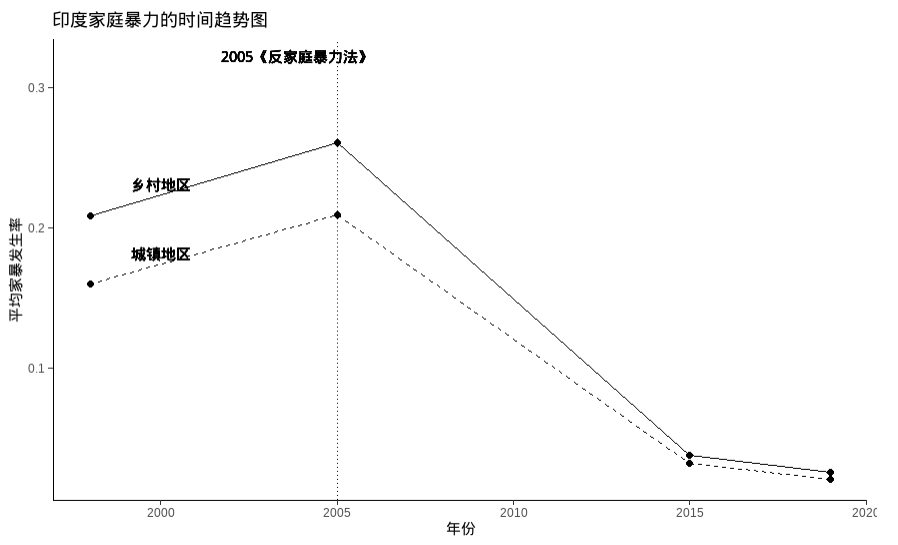
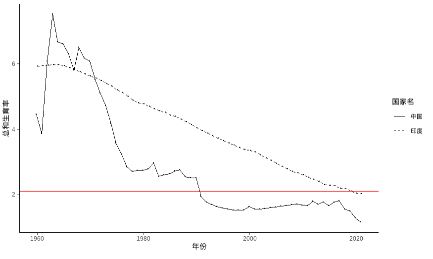
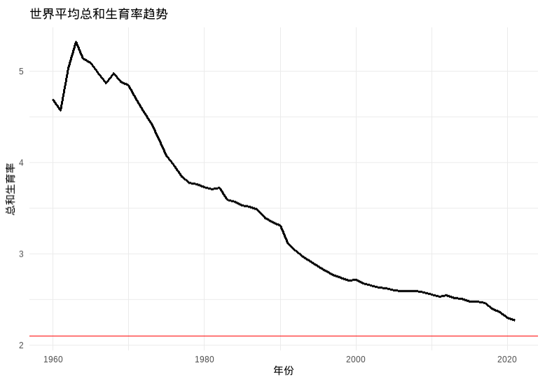
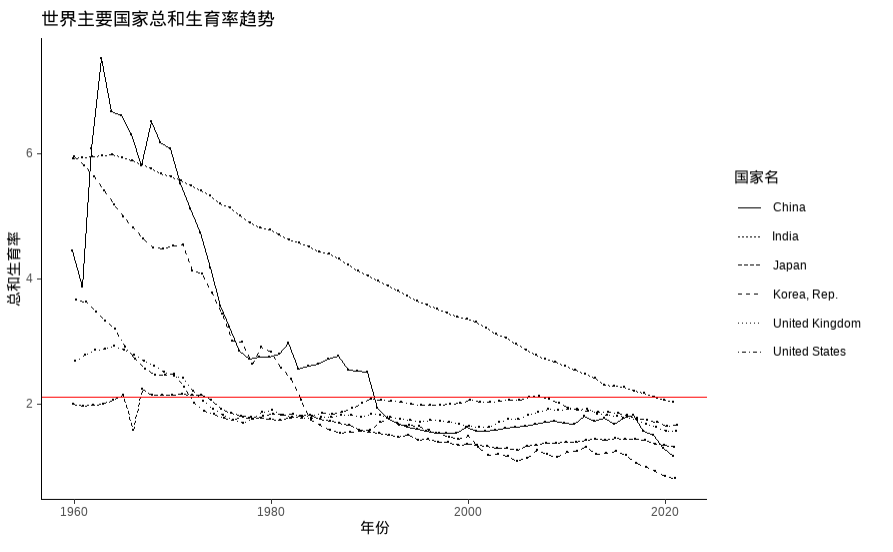

# 杨景媛自我审查与数据文档

<div align="center">

**🚨 重大学术诚信文档 🚨**

*作者承认系统性错误的证据*

<br>

**Language/语言**: [中文](#中文版本) | [English](#english-version)

</div>

### 目录

- [📋 概述](#概述)
- [🔍 提出的关键问题](#提出的关键问题)
- [📁 文件夹内容](#文件夹内容)
- [❗ 图表复现问题说明](#图表复现问题说明)
- [🚨 学术不端影响](#学术不端影响)
- [⚖️ 法律和伦理考量](#法律和伦理考量)
- [🎯 关键证据要点](#关键证据要点)
- [📊 错误统计分析](#错误统计分析)
- [🏛️ 所需机构回应](#所需机构回应)
- [📝 文档时间线](#文档时间线)
- [🔗 相关文档](#相关文档)

---

### 数据重建尝试

- `R语言绘图/` - 基于R的数据可视化尝试
  - `中国/` - 中国特定分析（4个子目录）
  - `印度/` - 印度特定分析（4个子目录）
  - `中国母职惩罚可视化/` - 中国母职惩罚可视化
  - `印度母职惩罚可视化/` - 印度母职惩罚可视化
  - `绪论-世界生育率/` - 全球生育率分析
  - `绪论-中印家暴趋势（分别）/` - 中印家庭暴力趋势

- `Stata绘图/` - 基于Stata的统计分析
  - `世界生育率与家暴/` - 全球生育率与家庭暴力相关性

- `自己收集整理的数据/` - **自己收集和整理的数据**
  - `世界家暴数据整理/` - 全球家庭暴力数据汇编
  - `道观数据爬取与整理/` - 宗教场所数据爬取和整理


## 📋概述

本文件夹包含**杨景媛自己的审查和数据文件**，这些文件是在武汉大学要求她在学术违规行为广泛曝光后审查其论文时提交的。这些内容作为**有记录的证据**，证明作者承认其被评为"**优秀硕士论文**"的作品中存在错误。

## 🔍提出的关键问题

### 这篇论文是如何获得优秀奖的？

这个自我审查文件夹的存在引发了对武汉大学学术监督的根本性问题：

1. **质量控制失败**：存在系统性错误的论文如何通过初审？
2. **优秀奖评选过程**：使用什么标准将这项有缺陷的工作指定为"优秀"？
3. **机构责任**：谁负责原始评估过程？
4. **学术标准**：这对大学的学术诚信标准说明了什么？

## 📁文件夹内容

## 🚨学术不端影响

### 作者的承认
这个审查文件夹的存在本身就构成了**杨景媛的隐性承认**，即她的论文包含需要纠正的重大错误。

### 机构责任
**武汉大学**承担重大责任：
- **初审失败**：允许有缺陷的论文通过
- **不当优秀奖**：将错误的工作指定为典范
- **系统性监督失败**：学术质量控制的崩溃
- **声誉损害**：对机构信誉的伤害

## ⚖️ 法律和伦理考量

### 学术欺诈要素
1. **明知提交**：提交已知有错误的工作
2. **机构欺骗**：误导大学关于工作质量
3. **优秀欺诈**：获得不应得的学术认可
4. **公众欺骗**：误传学术成就

### 机构罪责
1. **疏忽审查**：未能发现明显错误
2. **不当认可**：奖励有缺陷的工作
3. **标准违反**：违反学术诚信政策
4. **公众信任违反**：对高等教育信誉的损害

## 🎯关键证据要点

### 时间序列
1. **原始提交**：提交存在系统性错误的论文
2. **优秀奖**：机构授予"优秀硕士论文"地位
3. **公开曝光**：学术违规行为公开曝光
4. **强制审查**：大学要求自我检查
5. **错误承认**：作者提供纠正（此文件夹）

### 有记录的失败
- **数据伪造**：多个数据不一致实例
- **引用错误**：系统性引用违规
- **计算错误**：基本数学错误
- **事实不准确**：历史和地理错误
- **方法缺陷**：不当的统计方法

## 📊错误统计分析

基于主仓库中的综合错误文档（持续更新）：

- 伪造/篡改：11+ 个有记录的实例
- 抄袭：3+ 个确认案例
- 数据错误：12+ 个计算/事实错误
- 方法错误：12+ 个分析缺陷
- 引用违规：14+ 个引用违规
- 写作/格式错误：54+ 处语言与格式问题


## ❗图表复现问题说明

根据“杨的自我审查与数据文件”，论文部分图表无法完全复现。对图表目录中6张关键图的复现情况如下：

### 图1.1 中国家庭暴力的时间趋势图
### 图1.2 印度家庭暴力的时间趋势图
复现路径：`R语言绘图/绪论-中印家暴趋势（分别）/绪论-时间趋势.Rmd`

**发现问题：**
原始R代码存在低级错误：

```r
data1 <- read.csv("time_trend.csv")
list1 <- c(UR = "城镇", year = 2020, dv1 = 0.02)
list2 <- c(UR = "农村", year = 2020, dv1 = 0.02)
# 错误写法：data <- rbind(data, list1, list2)
# 正确写法：
data <- rbind(data1, list1, list2)
```
修正后可正常运行。

复现结果：
>图1.1：

图1.2：


---

### 图1.3 中印两国生育率趋势图
### 图2.1 全球各国家暴发生率直方图
### 图2.2 世界平均总和生育率趋势
### 图2.3 世界主要国家总和生育率趋势
复现路径：`R语言绘图/绪论-世界生育率/世界生育率趋势图.Rmd`

**发现问题：**
- 程序仅输出3张图，缺失“图2.1 全球各国家暴发生率直方图”。
- 检查Rmd文件，未发现任何直方图作图代码，无法复现该图。
复现结果：
>图1.3：

图2.2：

图2.3：


**结论：**
- 图2.1缺失，程序中无相关作图代码，无法复现。
- 图1.1、1.2原始代码有低级错误，修正后可复现。
- 图1.3、2.2、2.3可复现。
本文档是为**学术诚信目的**编制的，代表对公开可用学术工作的事实分析。所有指控都基于有记录的证据和提交学术材料的比较分析。

---

<div align="center">

**"学术诚信不仅关乎个人诚实——更关乎机构责任。"**

*问题仍然是：还有多少其他"优秀"论文包含类似的系统性错误？*

</div>

<div align="center">

**[ ⬆️ 返回顶部 ](#目录) | [🌍 English Version](#english-version)**

</div>

---


###### English Version

# Yang Jingyuan's Self-Review and Data Documentation

<div align="center">

**🚨 CRITICAL ACADEMIC INTEGRITY DOCUMENTATION 🚨**

*Evidence of Author's Admission to Systematic Errors*

</div>


### Table of Contents

- [📋 Overview](#overview)
- [🔍 Critical Questions Raised](#critical-questions-raised)
- [📁 Folder Contents](#folder-contents)
- [❗ Chart Reproduction Issues](#chart-reproduction-issues)
- [🚨 Academic Misconduct Implications](#academic-misconduct-implications)
- [⚖️ Legal and Ethical Considerations](#legal-and-ethical-considerations)
- [🎯 Key Evidence Points](#key-evidence-points)
- [📊 Statistical Analysis of Errors](#statistical-analysis-of-errors)
- [🏛️ Institutional Response Required](#institutional-response-required)
- [📝 Documentation Timeline](#documentation-timeline)
- [🔗 Related Documentation](#related-documentation)

---


## 📋 Overview

This folder contains **Yang Jingyuan's own review and data files** submitted **after** Wuhan University requested her to examine her thesis following widespread exposure of academic irregularities. The contents serve as **documented evidence** of the author's acknowledgment of errors in her work that was somehow awarded as an "**Excellent Master's Thesis**."

## 🔍Critical Questions Raised

### How Was This Thesis Awarded Excellence?

The presence of this self-review folder raises fundamental questions about Wuhan University's academic oversight:

1. **Quality Control Failure**: How did a thesis with systematic errors pass initial review?
2. **Excellence Award Process**: What criteria were used to designate this flawed work as "excellent"?
3. **Institutional Responsibility**: Who was responsible for the original evaluation process?
4. **Academic Standards**: What does this say about the university's academic integrity standards?

## 📁Folder Contents

### Core Documentation
- `YJYpaper_Master_Thesis_Review.pdf` - **Yang's official self-review acknowledging errors**
- `List_of_Figures_and_Tables.xlsx` - Revised data tables and figures

### Data Reconstruction Attempts
- `R语言绘图/` - R-based data visualization attempts
  - `中国/` - China-specific analyses (4 subdirectories)
  - `印度/` - India-specific analyses (4 subdirectories)  
  - `中国母职惩罚可视化/` - China motherhood penalty visualization
  - `印度母职惩罚可视化/` - India motherhood penalty visualization
  - `绪论-世界生育率/` - Global fertility rate analysis
  - `绪论-中印家暴趋势（分别）/` - China-India domestic violence trends

- `Stata绘图/` - Stata-based statistical analyses
  - `世界生育率与家暴/` - Global fertility and domestic violence correlation

- `自己收集整理的数据/` - **Self-collected and organized data**
  - `世界家暴数据整理/` - Global domestic violence data compilation
  - `道观数据爬取与整理/` - Religious site data scraping and organization

### Chart Reproduction Issues

According to the self-review and data files, several key figures in the thesis cannot be fully reproduced. The status of 6 key figures is as follows:

#### Figure 1.1 Time Trend of Domestic Violence in China
#### Figure 1.2 Time Trend of Domestic Violence in India
Reproduction path: `R语言绘图/绪论-中印家暴趋势（分别）/绪论-时间趋势.Rmd`

**Issue found:**
The original R code contains a basic error:

```r
data1 <- read.csv("time_trend.csv")
list1 <- c(UR = "城镇", year = 2020, dv1 = 0.02)
list2 <- c(UR = "农村", year = 2020, dv1 = 0.02)
# Incorrect: data <- rbind(data, list1, list2)
# Correct:
data <- rbind(data1, list1, list2)
```
After correction, the code runs normally.

Reproduction results:
>Figure 1.1:
 
Figure 1.2:
 

---

#### Figure 1.3 Fertility Trends in China and India
#### Figure 2.1 Histogram of Global Domestic Violence Rates
#### Figure 2.2 World Average Total Fertility Rate Trend
#### Figure 2.3 Total Fertility Rate Trends in Major Countries
Reproduction path: `R语言绘图/绪论-世界生育率/世界生育率趋势图.Rmd`

**Issue found:**
- Only 3 figures are output; "Figure 2.1 Histogram of Global Domestic Violence Rates" is missing.
- No histogram plotting code is found in the Rmd file, so this figure cannot be reproduced.
- The other 3 figures can be output by adjusting the code:
Reproduction results:
>Figure 1.3:

Figure 2.2:

Figure 2.3:


**Conclusion:**
- Figure 2.1 is missing; no relevant plotting code in the program, cannot be reproduced.
- Figures 1.1 and 1.2 had code errors, but can be reproduced after correction.
- Figures 1.3, 2.2, and 2.3 can be reproduced.


## 🚨Academic Misconduct Implications

### Author's Admission
The very existence of this review folder constitutes **Yang Jingyuan's implicit admission** that her thesis contained substantial errors requiring correction.

### Institutional Liability
**Wuhan University** bears significant responsibility for:
- **Failed Initial Review**: Allowing a flawed thesis to pass
- **Inappropriate Excellence Award**: Designating erroneous work as exemplary
- **Systemic Oversight Failure**: Breakdown in academic quality control
- **Reputational Damage**: Harm to institutional credibility

## ⚖️Legal and Ethical Considerations

### Academic Fraud Elements
1. **Knowing Submission**: Submitting work with known errors
2. **Institutional Deception**: Misleading the university about work quality
3. **Excellence Fraud**: Receiving undeserved academic recognition
4. **Public Deception**: Misrepresenting academic achievements

### Institutional Culpability
1. **Negligent Review**: Failure to detect obvious errors
2. **Inappropriate Recognition**: Awarding excellence to flawed work
3. **Standards Violation**: Breach of academic integrity policies
4. **Public Trust Violation**: Damage to higher education credibility

## 🎯Key Evidence Points

### Temporal Sequence
1. **Original Submission**: Thesis submitted with systematic errors
2. **Excellence Award**: Institution awarded "Excellent Master's Thesis" status
3. **Public Exposure**: Academic irregularities exposed publicly
4. **Forced Review**: University required self-examination
5. **Error Admission**: Author provided corrections (this folder)

### Documented Failures
- **Data Fabrication**: Multiple instances of inconsistent data
- **Citation Errors**: Systematic referencing irregularities  
- **Computational Mistakes**: Basic mathematical errors
- **Factual Inaccuracies**: Historical and geographical errors
- **Methodological Flaws**: Inappropriate statistical methods

## 📊Statistical Analysis of Errors

Based on the comprehensive error documentation in the main repository:

- **Fabrication/Falsification**: 11+ documented instances
- **Plagiarism**: 3+ confirmed cases
- **Data Errors**: 12+ computational/factual mistakes
- **Methodological Errors**: 12+ analytical flaws
- **Citation Irregularities**: 14+ referencing violations
- **Writing/Format Errors**: 54+ language and format issues

## 🏛️Institutional Response Required

### Immediate Actions Needed
1. **Degree Revocation**: Remove master's degree awarded to Yang Jingyuan
2. **Excellence Rescission**: Withdraw "Excellent Master's Thesis" designation
3. **Review Board Investigation**: Examine the original evaluation process
4. **Policy Reform**: Strengthen academic integrity oversight mechanisms
5. **Public Accountability**: Issue transparent statement on institutional failures

### Long-term Reforms
1. **Enhanced Review Processes**: Implement stricter thesis evaluation protocols
2. **Quality Assurance**: Establish independent verification mechanisms
3. **Faculty Training**: Improve academic integrity awareness
4. **Technology Integration**: Use plagiarism detection and data verification tools
5. **Transparency Measures**: Publish evaluation criteria and processes

## 📝Documentation Timeline

| Date | Event | Significance |
|------|-------|-------------|
| 2024 | Original thesis submission | Work contains systematic errors |
| 2024 | "Excellent" designation awarded | Institutional failure in evaluation |
| Late 2024/Early 2025 | Public exposure | Academic irregularities documented |
| 2025 | University requests review | Institutional damage control |
| 2025 | Self-review submitted | **Author's implicit error admission** |

## 🔗Related Documentation

- **Main Error Compilation**: [../README.md](../README.md)
- **Original Thesis**: [../paper/YJYpaper.pdf](../paper/YJYpaper.pdf)
- **Reporting Guidelines**: [../doc/compilations.md](../doc/compilations.md)
- **Formal Complaints**: [../report/](../report/)

## ⚠️Legal Notice

This documentation is compiled for **academic integrity purposes** and represents factual analysis of publicly available academic work. All allegations are based on documented evidence and comparative analysis of submitted academic materials.

---

<div align="center">

**"Academic integrity is not just about individual honesty—it's about institutional responsibility."**

*The question remains: How many other "excellent" theses contain similar systematic errors?*

</div>

---

**Last Updated**: August 2025  
**Status**: Under Investigation  
**Institutional Response**: Pending
